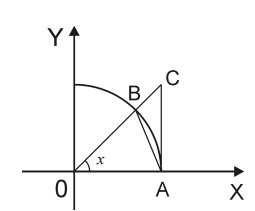

<!-- ~whodo fiixii, pluttan -->

# Подготовка к экзамену : Математический анализ

<!-- ?\toc -->

## Определения и понятия 

1. $\mathbb{N}$ - **множество натуральных чисел**, состоит из чисел, возникающих при счёте.
1. $\mathbb{Z}$ - **множество целых чисел**, состоит из натуральных чисел, нуля и чисел, противоположных натуральным.
2. $\mathbb{Q}$ - **множество рациональных чисел**, состоит из чисел, представимых в виде ${\dfrac{z}{n}}, z \in \mathbb{Z}, \ n \in \mathbb{N}$. 
3. $\mathbb{I}$ - **множество иррациональных чисел**, состоит из чисел, которые не представимы в виде ${\dfrac{z}{n}}, \ z \in \mathbb{Z}, \ n \in \mathbb{N}$, такие как $e, \pi, \sqrt{3}$ и т.д..

4. $\mathbb{R}$ - **множество действительных чисел**, состоит из рациональных и иррациональных чисел.

5. $\overline{\mathbb{R}}$ - **расширенное множество действительных чисел**, состоит из действительных чисел с добавлением $\{+\infty\}$ и $\{-\infty\}$.

1. **Окрестностью** $U(x)$ **точки $x$** называют любой интервал, содержащий эту точку.

1. **Проколотой окрестностью $
\overset{\circ}U(x)$ точки $x$** называют окрестность этой точки $U(x)$, за исключением самой точки $x$.  

1. **${\varepsilon}$-окрестностью точки $x_0$** (при положительном ${\varepsilon}$) называют интервал $(x_0-{\varepsilon}, \ x_0+{\varepsilon}$).

    $$U_{\varepsilon}(x_0) = \{x \in \mathbb{R}: \ x_0 - {\varepsilon} < x < x_0 + {\varepsilon}\}
    $$

1. **Правой (правосторонней) $\delta$-окрестностью точки** $x_0$ называют полуинтервал \\
$[x_0,\ x_0 + \delta), \ \delta > 0$.

    $$U^+_{\delta}(x_0) = \{x \in \mathbb{R}: \ x_0 \leqslant x < x_0 + {\delta}\}, \ \delta > 0
    $$

1. **Левой (левосторонней) $\delta$-окрестностью точки** $x_0$ называют полуинтервал \\
$(x_0 - \delta,\ x_0], \ \delta > 0$.

    $$U^-_{\delta}(x_0) = \{x \in \mathbb{R}: \ x_0 -\delta < x \leqslant x_0\},\ \delta > 0
    $$

1. **Окрестностью точки** $+\infty$ называют интервал $(a, +\infty), \ a > 0$.

    $$U(+\infty) = \{x \in \mathbb{R}: \ x > a\}, \ a > 0
    $$

1. **Окрестностью точки** $-\infty$ называют интервал $(-\infty, -a), \ a > 0$.
    
    $$U(-\infty) = \{x \in \mathbb{R}: \ x < -a\}, \ a > 0
    $$

1. **Окрестностью** $\infty$ (бесконечности без знака) называют объединение двух интервалов $(-\infty, -a) \cup (a, +\infty),\ a > 0$.

    $$U(\infty) = \{x \in \mathbb{R}: \ | x | > a\}, \ a > 0
    $$
   
1. **Последовательностью $\{X_n\}$** называется числовая функция натурального аргумента. Если
натуральному числу $n$ при этом поставлено в соответствие число $x_n$, то это число
называется $n$-м элементом последовательности; $n$ называют номером элемента $x_n$.

1. Последовательность чисел $\{X_n\}$ называется **неубывающей**, если $x_{n+1}\geqslant x_n, \ \forall\ n \in \mathbb{N}$.

1. Последовательность чисел $\{X_n\}$ называется **возрастающей**, если $x_{n+1} > x_n, \ \forall\ n \in \mathbb{N}$.

1. Последовательность чисел $\{X_n\}$ называется **невозрастающей**, если $x_{n+1} \leqslant x_n, \ \forall\ n \in \mathbb{N}$.

1.  Последовательность чисел $\{X_n\}$ называется **убывающей**, если $x_{n+1} < x_n, \ \forall\ n \in \mathbb{N}$.

1.  Неубывающие, невозрастающие, убывающие и возрастающие последовательности называют **монотонными**.
1.  Последовательность $\{X_n\}$ называется **постоянной**, если $ \forall n \in \mathbb{N}: \ x_n = c, \ c \in \mathbb{R}$.

1.  Последовательность $\{X_n\}$ называется **ограниченной сверху**, если $\exists M \in \mathbb{R}$, такое, что $\forall n \in \mathbb{N}: \ x_n \leqslant M$. 

1.  Последовательность $\{X_n\}$ называется **ограниченной снизу**, если $\exists M \in \mathbb{R}$, такое, что $\forall n \in \mathbb{N}: \ x_n \geqslant M$.

1.  Последовательность $\{X_n\}$, ограниченная и сверху и снизу, называют **ограниченной**: $\exists M > 0, \ M \in \mathbb{R}$, такое, что $\forall n \in \mathbb{N}: \ | x_n|  \leqslant M$. 

1.  Число $a$ называется **пределом числовой последовательности** $\{X_n\}$, если для любого, сколь угодно малого положительного ${\varepsilon}$ существует такой номер $N$, зависящий от ${\varepsilon}$, что для всех $n > N$ выполняется неравенство $|x_n - a|  < {\varepsilon}$.

    $$\lim\limits_{n \to \infty}x_n = a \iff \forall {\varepsilon}>0 \ \ \exists N = N({\varepsilon}) \in \mathbb{N}: \ \forall n > N \Rightarrow | x_n - a|  < {\varepsilon}
    $$

1. Числовая последовательность называется **сходящейся**, если существует предел этой последовательности, и он конечен.

1. Последовательность $\{X_n\}$ называется **фундаментальной**, если для любого ${\varepsilon} > 0$
существует номер $N = N({\varepsilon})$ такой, что при любых $m \geqslant N$ и $n \geqslant N$ выполняется
неравенство $| x_m - x_n|  < {\varepsilon}$. 

1. (определение по Коши) Число $a$ называется **пределом функции** $f(x)$ при $x \rightarrow x_0$, если для любого ${\varepsilon} > 0$ существует положительное число $\delta = \delta ({\varepsilon})$ такое, что для любого $x \in \overset{\circ}U_\delta(x_0)$ выполняется неравенство $| f(x) - a|  < {\varepsilon}$. 

    $$\lim\limits_{x \to x_0} f(x) = a \iff \forall{\varepsilon} > 0 \ \ \exists \delta = \delta({\varepsilon}) > 0 : \ \forall x \in \overset{\circ}U_\delta(x_0) \Rightarrow | f(x) - a|  < {\varepsilon}
    $$

2. (определение по Гейне) Число $a$ называется **пределом функции** $f(x)$ при $x \rightarrow x_0$, если для любой последовательности $\{X_n\}$ точек из $\overset{\circ}U(x_0)$, для которой $\lim\limits_{n \to \infty}x_n = x_0$, выполняется равенство $\lim\limits_{n \to \infty}\{f(x_n)\} = a$.

    $$\lim\limits_{x \to x_0}f(x) = a \iff \{\forall x_n \in \overset{\circ}U(x_0), \ n \in \mathbb{N}\} \ \cap \ \lim\limits_{n \to \infty}{x_n} = x_0 : \ 
    \lim\limits_{n \to \infty}\{f(x_n)\} = a
    $$

3. Число $a$ называется **правым (правосторонним) пределом функции** f(x) при $x \rightarrow x_0 +$, если для любого ${\varepsilon} > 0$ существует $\delta = \delta({\varepsilon}) > 0$ такое, что при любом $x \in {\overset{\circ\hspace{22pt}}{U^+_\delta(x_0)}} \ \ (\text{т.е.} \ x_0 < x < x_0 + \delta)$, выполняется неравенство $| f(x) - a|  < {\varepsilon}$.  

    $$\lim\limits_{x \to x_0 +} f(x) = a \iff \forall{\varepsilon} > 0 \ \ \exists \delta = \delta({\varepsilon}) > 0 : \ \forall x \in {\overset{\circ\hspace{22pt}}{U^+_\delta(x_0)}}  \Rightarrow | f(x) - a|  < {\varepsilon}
    $$

4. Число $a$ называется **левым (левосторонним) пределом функции** f(x) при $x \rightarrow x_0 -$, если для любого ${\varepsilon} > 0$ существует $\delta = \delta({\varepsilon}) > 0$ такое, что при любом $x \in {\overset{\circ\hspace{22pt}}{U^-_\delta(x_0)}}, \ \ (\text{т.е.} \ x_0 - \delta < x < x_0)$ выполняется неравенство $| f(x) - a|  < {\varepsilon}$.

    $$\lim\limits_{x \to x_0 -} f(x) = a \iff \forall{\varepsilon} > 0 \ \ \exists \delta = \delta({\varepsilon}) > 0 : \ \forall x \in {\overset{\circ\hspace{22pt}}{U^-_\delta(x_0)}}  \Rightarrow | f(x) - a|  < {\varepsilon}
    $$

5. Функцию $f(x)$ называют **ограниченной на множестве $D$**, если существует такое число $M > 0$, что для любых $x \in D$ выполняется неравенство $| f(x)|  \leqslant M$.

6. Функцию $f(x)$ называют **ограниченной** (на области определения $D_f$), если существует такое число $M > 0$, что для любых $x \in D_f$ выполняется неравенство $| f(x)|  \leqslant M$.

3. Функцию $f(x)$ называют **локально ограниченной в окрестности точки $a$**, если существует такое число $M > 0$ и такая окрестность $\overset{\circ}U_\delta(a)$, что для любых $x \in \overset{\circ}U_\delta(a)$ выполняется неравенство $| f(x)|  \leqslant M$.

4. Функцию $f(x)$ называют **бесконечно малой** при $x \rightarrow x_0, \ x_0 \in \overline{\mathbb{R}}$, если $\lim\limits_{x \to x_0} f(x) = 0$.

5. Функцию $f(x)$ называют **бесконечно большой** при $x \rightarrow x_0, \ x_0 \in \overline{\mathbb{R}}$, если $\lim\limits_{x \to x_0} f(x) = \infty$. 

6. $\lim\limits_{x \to 0} {\dfrac{sin(x)}{x}} = 1$ - **первый замечательный предел**.

7. $\lim\limits_{x \to \infty} \bigg(1 + {\dfrac{1}{x}}\bigg)^{x} = e$ - **второй замечательный предел**.

8. Функции $\alpha(x)$ и $\beta(x)$ называют **сравнимыми** бесконечно малыми при $x \rightarrow x_0$, если существует хотя бы один из пределов $\lim\limits_{x \to x_0} { \dfrac{\alpha(x)}{\beta(x)}}$ или $\lim\limits_{x \to x_0} { \dfrac{\beta(x)}{\alpha(x)}}$.

9. Функции $\alpha(x)$ и $\beta(x)$ называют **несравнимыми** бесконечно малыми при $x \rightarrow x_0$, если не существует ни конечного, ни бесконечного предела их отношения при $x \rightarrow x_0$.

10. Функции $\alpha(x)$ и $\beta(x)$ называют **бесконечно малыми одного порядка** при $x \rightarrow x_0$ и записывают $\alpha(x) = O(\beta(x))$, если существует отличный от нуля конечный предел отношения $\alpha(x)/\beta(x)$, при $x \rightarrow x_0$.
    
    $$\alpha(x) = O(\beta(x)) \ \text{при} \ x \rightarrow x_0 \iff \exists \lim\limits_{x \to x_0} {\dfrac{\alpha(x)}{\beta(x)}} = c \in \mathbb{R} \backslash \{0\}
    $$

11. Функцию $\alpha(x)$ называют **бесконечно малой более высокого порядка** малости по сравнению с $\beta(x)$ при $x \rightarrow x_0$ и записывают $\alpha(x) = o(\beta(x))$, если существует и равен нулю предел отношения $\alpha(x) / \beta(x)$, при $x \rightarrow x_0$.
    
    $$\alpha(x) = o(\beta(x)) \ \text{при} \ x \rightarrow x_0 \iff \exists \lim\limits_{x \to x_0} {\dfrac{\alpha(x)}{\beta(x)}} = 0
    $$

12. Функцию $\alpha(x)$ называют **бесконечно малой более низкого порядка** малости по сравнению с $\beta(x)$ при $x \rightarrow x_0$, если предел отношения $\alpha(x) / \beta(x)$, при $x \rightarrow x_0$, равен бесконечности.

13. Функции $\alpha(x)$ и $\beta(x)$ называют **эквивалентными** бесконечно малыми при $x \rightarrow x_0$, если предел их отношения при $x \rightarrow x_0$ равен 1.

    $$\alpha(x) \sim \beta(x) \ \text{при} \ x \rightarrow x_0 \iff \lim\limits_{x \to x_0}{\dfrac{\alpha(x)}{\beta(x)}} = 1
    $$

14. Функцию $\alpha(x)$ называют **бесконечно малой $k$-ого порядка** малости относительно $\beta(x)$ при $x \rightarrow x_0$, а число $k \ (k > 0)$ - **порядком малости** $\alpha(x)$ относительно $\beta(x)$ при $x \rightarrow x_0$, если функции $\alpha(x)$ и $\beta^k(x)$ являются бесконечно малыми одного порядка при $x \rightarrow x_0$, т.е.

    $$\lim\limits_{x \to x_0} {\dfrac{\alpha(x)}{\beta^k(x)}} = c \in \mathbb{R} \backslash \{0\}
    $$

15. Функцию $u(x)$ называют **бесконечно большой $k$-ого порядка** роста относительно $w(x)$ при $x \rightarrow x_0$, а число $k \ (k > 0)$ - **порядком роста** $u(x)$ относительно $w(x)$ при $x \rightarrow x_0$, если функции $u(x)$ и $w^k(x)$ являются бесконечно большими одного порядка при $x \rightarrow x_0$, т.е. 
    
    $$\lim\limits_{x \to x_0} {\dfrac{u(x)}{w^k(x)}} = c \in \mathbb{R} \backslash \{0\}
    $$

    <!-- правильно? -->
16. **Главная часть суммы бесконечно малых функций** - это слагаемое более низкого порядка малости по сравнению с каждым из остальных слагаемых.

17. **Приращением аргумента** в точке $x_0$ называется изменение аргумента функции от значения $x_0$ к другому значению x,
    
    $$\Delta x = x - x_0
    $$

18. **Приращением функции** в точке $x_0$ называется $\Delta y = f(x_0 + \Delta x) - f(x_0)$.

19. *(опр. 1)* Функция $f(x)$ называется **непрерывной в точке $x_0$**, если в этой точке существует конечный предел функции и он совпадает с значением функции в этой точке, т.е. $\exists \lim\limits_{x \to x_0}f(x) = f(x_0)$.

20. *(опр. 2)* Функция $f(x)$ называется **непрерывной в точке $x_0$**, если приращение функции в этой точке есть бесконечно малая функция при стремлении приращения аргумента к 0 ($\Delta x \rightarrow 0$).

21. Функция $f(x)$ называется **непрерывной в точке $x_0$ справа**, если в этой точке существует конечный *правый* предел функции и он совпадает с значением функции в этой точке, т.е. $\exists \lim\limits_{x \to x_0+}f(x) = f(x_0)$.

22. Функция $f(x)$ называется **непрерывной в точке $x_0$ слева**, если в этой точке существует конечный левый предел функции и он совпадает с значением функции в этой точке, т.е. $\exists \lim\limits_{x \to x_0-}f(x) = f(x_0)$.

23. Функция $f(x)$ **непрерывна на интервале $(a, b)$**, если она непрерывна в каждой его точке.

24. Функция $f(x)$ **непрерывна на отрезке $[a, b]$**, если она непрерывна на интервале $(a, b)$, в точке $a$ - непрерывна справа, т.е. $\lim\limits_{x \to a+}f(x) = f(a)$, в точке $b$ - непрерывна слева, т.е. $\lim\limits_{x \to b-}f(x) = f(b)$.

25. Если данная функция $f(x)$ не является непрерывной в точке $x_0$, то $x_0$ называется **точкой разрыва** функции $f(x)$.

26. **Точкой разрыва первого рода** называют такую точку разрыва функции, в которой существуют оба односторонних предела этой функции и они конечны.

27. **Точкой разрыва второго рода** называют такую точку разрыва функции, в которой хотя бы один из односторонних пределов функции не существует (в частности, равен бесконечности).

28. Если $x_0$ — точка разрыва функции первого рода и односторонние пределы функции в этой точке равны между собой, но не равны значению функции в этой точке или $f(x)$ не определена в этой точке, то такой разрыв называют **устранимым**, а точку $x_0$ - **точкой устранимого разрыва первого рода**.

29. Если $x_0$ — точка разрыва функции первого рода и односторонние пределы функции в этой точке не равны между собой, то такой разрыв называют **неустранимым**, а точку $x_0$ - **точкой неустранимого разрыва первого рода**. 

30. Если существует конечный предел $\lim\limits_{\Delta x \to 0} {\dfrac{f(x_0 + \Delta x) - f(x_0)}{\Delta x}}$, то он называется **производной функции $f(x)$ в точке** $x_0$ и обозначается $f'(x_0)$.

31. Если $f(x)$ определена в правосторонней окрестности точки $x_0$ и если 

    $\exists \lim\limits_{\Delta x \to 0+}{\dfrac{f(x_0+\Delta x) - f(x_0)}{\Delta x}}$, то этот предел называется **правой производной функции $f(x)$ в $x_0$** и обозначается $f'_+(x_0)$.

32. Если $f(x)$ определена в левосторонней окрестности точки $x_0$, и если 

    $\exists \lim\limits_{\Delta x \to 0-}{\dfrac{f(x_0+\Delta x) - f(x_0)}{\Delta x}}$, то этот предел называется **левой производной функции $f(x)$ в $x_0$** и обозначается $f'_-(x_0)$.

33. Пусть функция $y = f(x)$ определена в некоторой окрестности точки $x_0$. Функция называется **дифференцируемой в точке $x_0$**, если ее приращение $\Delta y$ в точке $x_0$ представимо в следующем виде: $\Delta y = A\Delta x + \alpha(\Delta x)\Delta x$, где $A$ - некоторое число, не зависящее от $\Delta x$, а $\lim\limits_{\Delta x \to 0}\alpha(\Delta x) = 0$.

1. **Дифференциалом функции $f(x)$ в точке $x_0$** называется главная часть приращения функции, линейная относительно приращения аргумента $\Delta x$.

2. **Дифференциалом $n$-го порядка** называется дифференциал от дифференциала $n-1$ порядка, т.е. $$d^{\ n}y = d(d^{\ n-1}y) = f^{(n)}(x)dx^n$$

3. **Производная $n$-ого порядка** от функции $y = f(x)$, есть производная от производной $n-1$ порядка, т.е. $$f^{(n)} = (f^{n-1}(x))'$$

4. Функция $f(x)$ называется **возрастающей на интервале** $(a, b)$, если $\forall x_1, x_2 \in (a, b)$, таких что $x_2 > x_1$, выполняется неравенство $f(x_2)>f(x_1)$.

5. Функция $f(x)$ называется **невозрастающей на интервале** $(a, b)$, если $\forall x_1, x_2 \in (a, b)$, таких что $x_2 > x_1$, выполняется неравенство $f(x_2)\leqslant f(x_1)$.

6. Функция $f(x)$ называется **убывающей на интервале** $(a, b)$, если $\forall x_1, x_2 \in (a, b)$, таких что $x_2 > x_1$, выполняется неравенство $f(x_2)<f(x_1)$.

7. Функция $f(x)$ называется **неубывающей на интервале** $(a, b)$, если $\forall x_1, x_2 \in (a, b)$, таких что $x_2 > x_1$, выполняется неравенство $f(x_2)\geqslant f(x_1)$.

8. Неубывающие, невозрастающие, убывающие и возрастающие функции называют **монотонными**.

9. Функция $f(x)$ называется **строго монотонной**, если она возрастающая или убывающая.

10. Точка $x_0$ называется **точкой локального минимума** функции $f(x)$, если $\exists U_{\delta}(x_0)$, такая что $\forall x \in U_{\delta}(x_0): \ f(x_0) \leqslant f(x)$.

11. Точка $x_0$ называется **точкой локального максимума** функции $f(x)$, если $\exists U_{\delta}(x_0)$, такая что $\forall x \in U_{\delta}(x_0): \ f(x_0) \geqslant f(x)$.

12. Точка $x_0$ называется **точкой строгого локального минимума** функции $f(x)$, если $\exists \overset{\circ}{U}_{\delta}(x_0)$, такая что $\forall x \in \overset{\circ}{U}_{\delta}(x_0): \ f(x_0) < f(x)$.

13. Точка $x_0$ называется **точкой строгого локального максимума** функции $f(x)$, если $\exists \overset{\circ}{U}_\delta(x_0)$, такая что $\forall x \in \overset{\circ}{U}_\delta(x_0): \ f(x_0) > f(x)$.

14. **Точками локального экстремума** называются точки локального максимума и строгого локального максимума, локального минимума и строгого локального минимума.

15. **Точками строгого локального экстремума** называются точки строгого локального максимума и минимума.

16. Точку $x_0$ из области определения функции $f(x)$ называют **критической**, если производная в ней равна 0 или не сущестует вовсе.

17. Точку $x_0$ из области определения функции $f(x)$ называют **стационарной**, если $f'(x_0) = 0$.

18. Прямая $Ax + By + C = 0$ называется **асимптотой** графика $y = f(x)$, если расстояние от точки $M(x, f(x))$ графика функции до этой прямой стремится к 0 при бесконечном удалении точки $M$ от начала координат. 

19. Прямая $x = a$ называется **вертикальной асимптотой** графика функции $y = f(x)$, если хотя бы один из пределов $\lim\limits_{x \to a+(-)}f(x) = \infty$ 

1. Прямая $y = kx + b$ называется **правой наклонной асимптотой** графика функции $y = f(x)$, если эту функцию можно представить в виде $f(x) = kx + b + \alpha(x)$  при $x \rightarrow +\infty$, где $k, b \in \mathbb{R}$ и $\alpha(x)$ - бесконечно малая функция.

2. Прямая $y = kx + b$ называется **левой наклонной асимптотой** графика функции $y = f(x)$, если эту функцию можно представить в виде $f(x) = kx + b + \alpha(x)$  при $x \rightarrow -\infty$, где $k, b \in \mathbb{R}$ и $\alpha(x)$ - бесконечно малая функция.

3. Пусть функция $f(x)$ дифференцируема на интервале $(a, b)$. График функции $y = f(x)$ имеет на интервале $(a, b)$ **выпуклость вверх**, если он лежит не выше любой касательной к графику на (a, b).

4. Пусть функция $f(x)$ дифференцируема на интервале $(a, b)$. График функции $y = f(x)$ имеет на интервале $(a, b)$ **выпуклость вниз**, если он лежит не ниже любой касательной к графику на (a, b).

5. Точка $x_0 \in (a,b)$ называется **точкой перегиба** функции $f(x)$, если эта функция непрерывна в точке $x_0$ и если $\exists \delta > 0$ такое, что направления выпуклостей функции $f(x)$ на интервалах $(x_0-\delta; x_0)$ и $(x_0; x_0+\delta)$ различны.

<!-- ?\newpage -->
## Вопросы для подготовки к экзамену

### 1. *Теорема (о единственности предела сходящейся последовательности)*

<!-- ?\begin{Quote2} -->
<!-- ?\small\centering --> 
Используются определения 15, 25, 26 из списка
<!-- ?\end{Quote2} -->

Если последовательность имеет предел, то этот предел - единственный.

<!-- ?\vspace*{20pt} -->
*Доказательство (от противного)*

Пусть $a, b \in \mathbb{R}, \ a \neq b$, где $a$ и $b$ - пределы сходящейся последовательности $\{X_n\}$:

$$
\lim\limits_{n \to \infty} x_n = a,\ \lim\limits_{n \to \infty} x_n = b, \ a \neq b
$$

По определению предела: 

$$
\forall {\varepsilon} > 0, \ \exists N_1 = N_1({\varepsilon}) \in \mathbb{N} : \ \forall n > N_1 \Rightarrow  | x_n - a|  < {\varepsilon} 
$$

$$
\forall {\varepsilon} > 0, \ \exists N_2 = N_2({\varepsilon}) \in \mathbb{N} : \ \forall n > N_2 \Rightarrow  | x_n - b|  < {\varepsilon} 
$$

Примем ${\varepsilon} = {\dfrac{| b - a| }{3}}$ и при $n > max(N_1, \ N_2)$ получим 

$$
| b - a|  = | x_n - a + b - x_n|  \leqslant | x_n - a|  + | b - x_n|  = | x_n - a|  + | x_n - b|  \Rightarrow | b - a|  < 2{\varepsilon}
$$ 

Или $| b-a|  < 2 \cdot {\dfrac{| b - a| }{3}}$, т.е. $| b-a|  < \dfrac{2}{3}| b - a| $, $\dfrac{1}{3}| b-a|  < 0$, чего не может быть $\Rightarrow$ $a \neq b$ - неверно, т.е. $a = b \Rightarrow$ предел единственный. 

Теорема доказана.

<!-- ?\newpage -->
### 2. *Теорема (об ограниченности сходящейся последовательности)*

<!-- ?\begin{Quote2} -->
<!-- ?\small\centering --> 
Используются определения 15, 24, 25, 26 из списка
<!-- ?\end{Quote2} -->

Всякая сходящаяся последовательность является ограниченной.

<!-- ?\vspace*{20pt} -->
*Доказательство*

Пусть $\{X_n\}$ - сходящаяся последовательность. Тогда по определению, у нее существует конечный предел 

$$
\lim\limits_{n \to \infty}x_n = a \iff \forall {\varepsilon} > 0 \ \exists N = N({\varepsilon})\in \mathbb{N}: \ \forall n > N \Rightarrow | x_n - a|  < {\varepsilon},
$$

$$
-{\varepsilon}+a < x_n < {\varepsilon} + a, \ \forall n > N
$$

Обозначим через $A$ максимальное число среди $| x_1| , | x_2| , ..., | x_n| , | a-{\varepsilon}| , | a + {\varepsilon}| $, т.е.

$$
A = max(| x_1| , | x_2| , ..., | x_n| , | a-{\varepsilon}| , | a + {\varepsilon}| )
$$

Тогда $\forall n \in \mathbb{N}$ выполняется $| x_n|  < A, \Rightarrow$ последовательность ограничена. 

Теорема доказана.

     

<!-- ?\newpage -->
### 3. *Теорема (о локальной ограниченности функции, имеющей конечный предел)*

<!-- ?\begin{Quote2} -->
<!-- ?\small\centering --> 
Используются определения 28, 34 из списка
<!-- ?\end{Quote2} -->

Если функция
$f(x)$ имеет конечный предел при $x \rightarrow x_0$, то $f(x)$ локально ограничена.

<!-- ?\vspace*{20pt} -->
*Доказательство*

По условию $\exists$ конечный предел $\lim\limits_{x \to x_0}f(x) = a$, тогда

$$
\forall {\varepsilon} > 0 \ \exists\delta=\delta({\varepsilon} )>0: \ \forall x \in \overset{\circ}U_\delta(x_0) \Rightarrow | f(x) - a|  < {\varepsilon}
$$

Пусть ${\varepsilon} = 1$, тогда $| f(x)|  - | a|  \leqslant | f(x) - a|  < 1$, а значит

$$
\forall x \in \overset{\circ}U_\delta(x_0) \Rightarrow | f(x)|  <1 + |a|  = const \overset{\text{по опр.}}{\Rightarrow}$$ 

$f(x)$ является локально ограниченной в окрестности точки $x_0$. 

Теорема доказана.

<!-- ?\newpage -->
### 4. *Теорема (о сохранении функцией знака своего предела)*

<!-- ?\begin{Quote2} -->
<!-- ?\small\centering --> 
Используются определения 28 из списка
<!-- ?\end{Quote2} -->

Если $\lim\limits_{x \to x_0} f(x) = A \neq 0$, то $\exists \overset{\circ}U_\delta(x_0): \ \forall x \in \overset{\circ}U_\delta(x_0)$ функция $f(x)$ сохраняет знак своего предела.

<!-- ?\vspace*{20pt} -->
*Доказательство*

По условию $\exists$ конечный $\lim\limits_{x \to x_0} f(x) = a > 0 \overset{\text{по опр.}}{\Rightarrow}$

$$
\forall {\varepsilon} > 0 \ \exists\delta=\delta({\varepsilon} )>0: \ \forall x \in \overset{\circ}U_\delta(x_0) \Rightarrow | f(x) - a|  < {\varepsilon}
$$

* в случае $a > 0$ выбираем ${\varepsilon} = {\dfrac{a}{2}}$, тогда 
    $$| f(x) - a|  < {\dfrac{a}{2}}$$
    $$-{\dfrac{a}{2}}< f(x) - a < {\dfrac{a}{2}}$$
    $${\dfrac{a}{2}}< f(x) < {\dfrac{3a}{2}}$$

    Следовательно $f(x) > {\dfrac{a}{2}}>0$, т.е. данная функция положительна при $x \in \overset{\circ}U_\delta(x_0)$.

* в случае $a < 0$ выбираем ${\varepsilon} = -{\dfrac{a}{2}}$, тогда 
    
    $$| f(x) - a|  < - {\dfrac{a}{2}}$$
    $${\dfrac{a}{2}}< f(x) - a < -{\dfrac{a}{2}}$$
    $${\dfrac{3a}{2}}< f(x) < {\dfrac{a}{2}}$$

    Следовательно $f(x) < {\dfrac{a}{2}}< 0$, т.е. данная функция отрицательна при $x \in \overset{\circ}U_\delta(x_0)$. 

Теорема доказана.

<!-- ?\newpage -->
### 5. *Теорема (о предельном переходе в неравенстве)*

<!-- ?\begin{Quote2} -->
<!-- ?\small\centering --> 
Используются определения 28 из списка
<!-- ?\end{Quote2} -->

Пусть функции $f(x)$ и $g(x)$ определены в проколотой окрестности $\overset{\circ}U(x_0)$ точки $x_0$, причем для любого $x \in \overset{\circ}U(x_0)$ выполняется неравенство $f(x) \geqslant g(x)$. Тогда, если эти функции имеют пределы $a = \lim\limits_{x \to x_0}f(x)$
и $b = \lim\limits_{x \to x_0}g(x)$, то $a \geqslant b$.

<!-- ?\vspace*{20pt} -->
*Доказательство*

По условию $\forall x \in \overset{\circ}U(x_0): \ f(x) \geqslant g(x) \Rightarrow f(x) - g(x) \geqslant 0$, тогда по теореме о сохранении функцией знака своего предела:

$$
\lim\limits_{x \to x_0}(f(x) - g(x)) \geqslant 0 \Rightarrow \lim\limits_{x \to x_0}f(x) - \lim\limits_{x \to x_0}g(x) = a - b \geqslant 0, \Rightarrow a \geqslant b
$$

Теорема доказана.

<!-- ?\newpage -->
### 6. *Теорема (о пределе промежуточной функции)*

<!-- ?\begin{Quote2} -->
<!-- ?\small\centering --> 
Используются определения 28 из списка
<!-- ?\end{Quote2} -->

Пусть для всех $x$ из некоторой проколотой окрестности $\overset{\circ}U(x_0)$ точки $x_0$ выполняется двойное неравенство
$f(x) \leqslant g(x) \leqslant h(x)$, и пусть существуют пределы $\lim\limits_{x \to x_0}f(x)$ и $\lim\limits_{x \to x_0}h(x)$, равные одному и тому же числу $a$. Тогда и $\lim\limits_{x \to x_0}g(x) = a$.

<!-- ?\vspace*{20pt} -->
*Доказательство*
    
По условию $\exists \lim\limits_{x \to x_0}f(x) = a$, $\lim\limits_{x \to x_0}h(x) = a$, тогда по определению предела функции, 

$$
\forall {\varepsilon}  > 0 \ \exists \delta_1= \delta_1 ({\varepsilon} ) > 0: \ \forall x \in \overset{\circ}U_{\delta_1}(x_0) \Rightarrow | f(x) - a|  < {\varepsilon}
$$

$$
\text{т.е.} \ \ a - {\varepsilon} < f(x) < a + {\varepsilon}
$$

$$
\forall {\varepsilon}  > 0 \ \exists \delta_2= \delta_2 ({\varepsilon} ) > 0: \ \forall x \in \overset{\circ}U_{\delta_2}(x_0) \Rightarrow | h(x) - a|  < {\varepsilon}
$$

$$
\text{т.е.} \ \ a - {\varepsilon} < h(x) < a + {\varepsilon}
$$

Тогда при $x \in \overset{\circ}U_{\delta}(x_0), \ \delta = min(\delta_1, \delta_2)$, выполняется неравенство

$$
a - {\varepsilon} < f(x) \leqslant g(x) \leqslant h(x) < a+ {\varepsilon}
$$
$$
a - {\varepsilon} <  g(x) < a+ {\varepsilon}
$$
$$
| g(x) - a|  < {\varepsilon}
$$

Таким образом, получаем

$$
\forall {\varepsilon} > 0 \ \exists \delta = \delta({\varepsilon}) > 0: \ \forall x \in \overset{\circ}U_{\delta}(x_0) \Rightarrow | g(x) - a|  < {\varepsilon} \iff \lim\limits_{x \to x_0} g(x) = a
$$

Теорема доказана.

<!-- ?\newpage -->
### 7. *Теорема (о пределе произведения функций)*

<!-- ?\begin{Quote2} -->
<!-- ?\small\centering --> 
Используются определения 28, 35 из списка
<!-- ?\end{Quote2} -->

Если $\exists$ конечные пределы $\lim\limits_{x \to x_0}f(x)=a$ и $\lim\limits_{x \to x_0}g(x) = b$, то $\lim\limits_{x \to x_0}(f(x)\cdot g(x)) = a\cdot b = \lim\limits_{x \to x_0}f(x)\cdot \lim\limits_{x \to x_0}g(x)$.

<!-- ?\vspace*{20pt} -->
*Доказательство*

По условию $\exists$ конечные пределы $\lim\limits_{x \to x_0}f(x)=a$ и $\lim\limits_{x \to x_0}g(x) = b$, тогда по теореме о связи функции, ее предела и бесконечно малой имеем

$$
f(x) = a + \alpha(x), \ \text{где} \ \alpha(x) - \text{бесконечно малая функция при} \ x \rightarrow x_0 
$$ 

$$
g(x) = b + \beta(x), \ \text{где} \ \beta(x) - \text{бесконечно малая функция при} \ x \rightarrow x_0 
$$

Тогда

$$
f(x)\cdot g(x) = (a + \alpha(x))\cdot(b + \beta(x)) = a\cdot b + a\cdot \beta(x) + \alpha(x)\cdot b + \alpha(x)\cdot \beta(x)
$$

$$
\lim\limits_{x \to x_0}(f(x)\cdot g(x)) = \lim\limits_{x \to x_0}(a\cdot b + \underbrace{a\cdot \beta(x)}_{\text{б.м. при} \ x \rightarrow x_0} + \underbrace{\alpha(x)\cdot b}_{\text{б.м. при} \ x \rightarrow x_0} + \underbrace{\alpha(x)\cdot \beta(x)}_{\text{б.м. при} \ x \rightarrow x_0}) =
$$

$$
= \lim\limits_{x \to x_0}(a\cdot b) = a\cdot b = \lim\limits_{x \to x_0}f(x) \cdot \lim\limits_{x \to x_0}g(x)
$$

Теорема доказана.

<!-- ?\newpage -->
### 8. *Теорема (о пределе сложной функции)*

<!-- ?\begin{Quote2} -->
<!-- ?\small\centering --> 
Используются определения 25, 29 из списка
<!-- ?\end{Quote2} -->

Если функция $y = f(x)$ имеет в точке $x = a$ конечный предел, равный $b$, и $f(x) \neq b$ в некоторой проколотой окрестности $\overset{\circ}U(a)$ этой точки, а функция $g(y)$ имеет в точке $b$ конечный предел $c$, то сложная функция $g(f(x))$ имеет $\lim\limits_{x \to a}g(f(x)) = c$.

<!-- ?\vspace*{20pt} -->
*Доказательство*

По определению предела функции по Гейне имеем:

$$
\exists \lim\limits_{x \to a}f(x) = b \iff \{\forall x_n \in \overset{\circ}U(a), \ n \in \mathbb{N}\} \ \cap \ \lim\limits_{n \to \infty}{x_n} = a : \ \lim\limits_{n \to \infty}\{f(x_n)\} = b
$$

$$
\exists \lim\limits_{y \to b}g(y) = c \iff \{\forall y_n \in \overset{\circ}U(b), \ n \in \mathbb{N}\} \ \cap \ \lim\limits_{n \to \infty}{y_n} = b : \ \lim\limits_{n \to \infty}\{g(y_n)\} = c
$$

Пусть $\{X_n\}$ - произвольная последовательность, стремящаяся к точке $a$  и $x_n \neq a \ \forall n \in \mathbb{N}$. Тогда $\lim\limits_{n \to \infty}{\{f(x_n)\}} = b$, но $f(x_n) \neq b \ \forall n \in \mathbb{N}$. Пусть $y_n = f(x_n)$. Поскольку $\lim\limits_{n \to \infty}{\{y_n\}} = b$ и $y_n \neq b \ \forall n \in \mathbb{N}$, имеем $\lim\limits_{n \to \infty}{\{g(y_n)\}} = c$, т.е.

$$
\{\forall x_n \in \overset{\circ}U(a), \ n \in \mathbb{N}\} \ \cap \ \lim\limits_{n \to \infty}{x_n} = a : \ \lim\limits_{n \to \infty}\{g(f(x_n))\} = c \iff \lim\limits_{n \to \infty} g(f(x)) = c
$$

Теорема доказана.

<!-- ?\newpage -->
### 9. *Вывод первого замечательного предела*

> $$ \lim\limits_{x \to 0} {\dfrac{sin(x)}{x}} = 1 $$

Пусть $0 < x < {\dfrac{\pi}{2}}$. Рассмотрим окружность радиуса $R$ с центром в начале координат,
пересекающую ось абсцисс в точке $A$, и пусть угол $\angle AOB$ равен $x$ (радиан). Пусть, далее,
$CA$ — перпендикуляр к этой оси, $C$ — точка пересечения с этим перпендикуляром продолжения отрезка $OB$ за точку $B$. Тогда

$$S_{\triangle OAB} < S_{\sector OAB} < S_{\triangle OAC}$$
$$\dfrac{1}{2}R^2sin(x) <\dfrac{1}{2}R^2x < \dfrac{1}{2}R^2tg(x)$$
$$sin(x) < x < tg(x)$$
$$1 < \dfrac{x}{sin(x)} < \dfrac{1}{cos(x)}$$
$$1 > \dfrac{sin(x)}{x} > cos(x), \ \text{при} \ x \in (0, \dfrac{\pi}{2})$$

Рассмотрим $x \in (-{\dfrac{\pi}{2}}, 0)$. Сделаем замену $\beta = -x$, таким образом $\beta \in (0, {\dfrac{\pi}{2})}$, а значит справедливо следующее неравенство:
$$1 > \dfrac{sin(\beta)}{\beta} > cos(\beta)$$
Вернемся к замене $\beta = -x$

$$1 > \dfrac{sin(-x)}{-x} > cos(-x)$$
$$1 > \dfrac{-sin(x)}{-x} > cos(x)$$
$$1 > \dfrac{sin(x)}{x} > cos(x) \ \text{при} \ x \in (-{\dfrac{\pi}{2}}, 0)$$

Таким образом, полученное неравенство справедливо для $x \in ({-{\dfrac{\pi}{2}}}, 0)\cup(0, {\dfrac{\pi}{2}})$.
Перейдем к пределу при $x \rightarrow 0$:

$$
\begin{rcases}\lim\limits_{x \to 0}cos(x) = 1\\ 
\lim\limits_{x \to 0}1 = 1
\end{rcases} \Rightarrow \ \text{(по т. о пределе промежуточной функции)} \ \lim\limits_{x \to 0}\dfrac{sin(x)}{x} = 1 
$$

<!-- ?\newpage -->
### 10. *Теорема (о связи функции, ее предела и бесконечно малой)*

<!-- ?\begin{Quote2} -->
<!-- ?\small\centering --> 
Используются определения 28, 35 из списка
<!-- ?\end{Quote2} -->

Равенство $\lim\limits_{x \to x_0}f(x) = a$ имеет место $\iff f(x) = a + \alpha(x)$, где $\alpha(x)$ - бесконечно малая функция при $x \rightarrow x_0$.

<!-- ?\vspace*{20pt} -->
*Доказательство*

$(\Rightarrow)$

По условию $\exists$ конечный $\lim\limits_{x \to x_0}f(x) = a$, тогда по определению

$$
\forall{\varepsilon} > 0 \ \exists \overset{\circ}U_\delta(x_0): \ \forall x \in \overset{\circ}U_\delta(x_0) \Rightarrow |f(x) - a| <{\varepsilon}
$$

Обозначим $f(x) - a = \alpha(x)$. Тогда $|\alpha(x)| < {\varepsilon}\ \ \forall x \in \overset{\circ}U_\delta(x_0) \overset{\text{по опр.}}\Rightarrow \lim\limits_{x \to x_0}\alpha(x) = 0,$ т.е. $\alpha(x)$ - бесконечно малая функция при $x \rightarrow x_0$. 

Но $\alpha(x) = f(x) - a \Rightarrow f(x) = a + \alpha(x), \text{ где } \lim\limits_{x \to x_0}\alpha(x) = 0$.

$(\Leftarrow)$

По условию $f(x) = a + \alpha(x),\text{ где } \lim\limits_{x \to x_0}\alpha(x) = 0$, тогда по определению

$$
\forall{\varepsilon} > 0 \ \exists \overset{\circ}U_\delta(x_0): \ \forall x \in \overset{\circ}U_\delta(x_0) \Rightarrow |\alpha(x)| <{\varepsilon}
$$

Но по условию $f(x) = a + \alpha(x) \Rightarrow \alpha(x) = f(x) - a$, отсюда имеем

$$
\forall{\varepsilon} > 0 \ \exists \overset{\circ}U_\delta(x_0): \ \forall x \in \overset{\circ}U_\delta(x_0) \Rightarrow |f(x) - a| <{\varepsilon} \overset{\text{по опр.}}\Rightarrow \lim\limits_{x \to x_0}f(x) = a
$$

Теорема доказана.

<!-- ?\newpage -->
### 11. *Теорема (о произведении бесконечно малой функции на ограниченную)*

<!-- ?\begin{Quote2} -->
<!-- ?\small\centering --> 
Используются определения 34, 35 из списка
<!-- ?\end{Quote2} -->

Если $\alpha(x)$ - бесконечно малая функция при $x \rightarrow x_0$, $f(x)$ - ограниченная функция, то $\alpha(x)\cdot f(x)$ - бесконечно малая функция при $x \rightarrow x_0$.

<!-- ?\vspace*{20pt} -->
*Доказательство*

По условию  $\alpha(x)$ - бесконечно малая функция при $x \rightarrow x_0$, тогда

$$
\forall {\varepsilon} > 0 \ \exists\overset{\circ}U_1(x_0): 
\forall x \in \overset{\circ}U_1(x_0) \Rightarrow |\alpha(x)| < \dfrac{ {\varepsilon}}{c}
$$
 
$f(x)$ - ограниченная функция, тогда

$$
|f(x)| < c, \text{ где } c = const, \ \forall x \in \overset{\circ}U_2(x_0)
$$

Таким образом,

$$
\forall x \in \overset{\circ}U(x_0) = \overset{\circ}U_1(x_0) \cap \overset{\circ}U_2(x_0):
$$
$$
|\alpha(x)\cdot f(x)| < \dfrac{ {\varepsilon}}{c} \cdot c \Rightarrow
$$

$ |\alpha(x)\cdot f(x)| < {\varepsilon} \Rightarrow \alpha(x)\cdot f(x)$ - бесконечно малая функция при  $x \rightarrow x_0$

Теорема доказана.

<!-- ?\newpage -->
### 12. *Теорема (о связи между бесконечно большой и бесконечно малой)*

<!-- ?\begin{Quote2} -->
<!-- ?\small\centering --> 
Используются определения 28, 35, 36 из списка
<!-- ?\end{Quote2} -->

$\alpha(x)$ - бесконечно малая функция при $x \rightarrow x_0$, отличная от нуля в некоторой проколотой окрестности точки $x_0 \ \Rightarrow \ {\dfrac{1}{\alpha(x)}}$ - бесконечно большая функция при $x \rightarrow x_0$.

$f(x)$ - бесконечно большая функция при $x \rightarrow x_0 \ \Rightarrow \ {\dfrac{1}{f(x)}}$ - бесконечно малая функция при $x \rightarrow x_0$.

<!-- ?\vspace*{20pt} -->
*Доказательство*

Пусть $\alpha(x)$ - бесконечно малая функция при $x \rightarrow x_0$, отличная от нуля в некоторой проколотой окрестности $\overset{\circ}U(x_0)$ точки $x_0$. Выберем произвольное $E > 0$. Тогда 

$$
\text{для } {\varepsilon} = \dfrac{1}{E} > 0 \ \ \exists \overset{\circ}U_1(x_0): \ \forall x \in \overset{\circ}U(x_0) \cap \overset{\circ}U_1(x_0) \Rightarrow 0 < |\alpha(x)| < {\varepsilon}, \text{ т.е.}
$$
$$
\dfrac{1}{|\alpha(x)|} > E, \overset{\text{по опр.}}\Rightarrow \dfrac{1}{\alpha(x)} \text{ - бесконечно большая функция при } x \rightarrow x_0 
$$

Пусть $f(x)$ - бесконечно большая функция при  $x \rightarrow x_0$. Выберем произвольное ${\varepsilon} > 0$. Тогда 

$$
\text{для } E = \dfrac{1}{{\varepsilon}} > 0 \ \ \exists \overset{\circ}U(x_0): \ \forall x \in \overset{\circ}U(x_0) \Rightarrow |f(x)| > E, \text{ т.е.}
$$
$$
\dfrac{1}{f(x)} < \dfrac{1}{E} = {\varepsilon}, \overset{\text{по опр.}}\Rightarrow \dfrac{1}{f(x)} \text{ - бесконечно малая функция при } x \rightarrow x_0 
$$ 

Теорема доказана.

<!-- ?\newpage -->
### 13. *Теорема (о замене бесконечно малой на эквивалентную под знаком предела)*

<!-- ?\begin{Quote2} -->
<!-- ?\small\centering --> 
Используются определения 35, 44 из списка
<!-- ?\end{Quote2} -->

Пусть $\alpha(x)\sim\beta(x)$ при $x \rightarrow x_0$, и $f(x)$ - некоторая функция, определенная в проколотой окрестности $\overset{\circ}U(x_0)$ точки $x_0$. Тогда:

* если существует предел при $x \rightarrow x_0$ произведения $\alpha(x)\cdot f(x)$, то он не изменится при замене $\alpha(x)$ на эквивалентную при $x \rightarrow x_0$ бесконечно малую функцию $\beta(x)$

* если существует предел при $x \rightarrow x_0$ частного ${\dfrac{f(x)}{\alpha(x)}}$ , то он не изменится при замене $\alpha(x)$ на эквивалентную при $x \rightarrow x_0$ бесконечно малую функцию $\beta(x)$

<!-- ?\vspace*{20pt} -->
*Доказательство*

По условию $\alpha(x)\sim\beta(x)$ при $x \rightarrow x_0$, тогда по определению
$\lim\limits_{x \to x_0}{\dfrac{\alpha(x)}{\beta(x)}} = 1$.
Таким образом,

* $\lim\limits_{x \to x_0}(\alpha(x)\cdot f(x)) = \lim\limits_{x \to x_0}{\dfrac{\alpha(x)\cdot\beta(x)\cdot f(x)}{\beta(x)}} = \lim\limits_{x \to x_0}{\dfrac{\alpha(x)}{\beta(x)}}\cdot\lim\limits_{x \to x_0}(\beta(x)\cdot f(x)) = \lim\limits_{x \to x_0}(\beta(x)\cdot f(x))$
* $\lim\limits_{x \to x_0}{\dfrac{f(x)}{\alpha(x)}} = \lim\limits_{x \to x_0}{\dfrac{\beta(x)\cdot f(x)}{\alpha(x)\cdot\beta(x)}} = \lim\limits_{x \to x_0}{\dfrac{\beta(x)}{\alpha(x)}}\cdot\lim\limits_{x \to x_0}{\dfrac{f(x)}{\beta(x)}} = \lim\limits_{x \to x_0}{\dfrac{f(x)}{\beta(x)}}$.

Теорема доказана.

<!-- ?\newpage -->
### 14. *Теорема (о необходимом и достаточном условии эквивалентности бесконечно малых)*

<!-- ?\begin{Quote2} -->
<!-- ?\small\centering --> 
Используются определения 35, 42, 44 из списка
<!-- ?\end{Quote2} -->

Две бесконечно малые функции $\alpha(x)$ и $\beta(x)$ при $x \rightarrow x_0$ эквивалентны $\iff$ их разность имеет больший порядок малости при $x \rightarrow x_0$ по сравнению с каждой из них.

<!-- ?\vspace*{20pt} -->
*Доказательство*

$(\Rightarrow)$

По условию $\alpha(x) \sim \beta(x)$ при $x \rightarrow x_0$, тогда по определению $\lim\limits_{x \to x_0}{\dfrac{\alpha(x)}{\beta(x)}} = 1$.
Таким образом,

$$
\lim\limits_{x \to x_0}{\dfrac{\alpha(x) - \beta(x)}{\beta(x)}} = \lim\limits_{x \to x_0}{\dfrac{\alpha(x)}{\beta(x)}} - 1 = 0, \overset{\text{по опр.}}\Rightarrow \alpha(x) - \beta(x) = o (\beta(x)) \text{ при } x \rightarrow x_0
$$

$$
\lim\limits_{x \to x_0}{\dfrac{\alpha(x) - \beta(x)}{\alpha(x)}} = 1 - \lim\limits_{x \to x_0}{\dfrac{\beta(x)}{\alpha(x)}} = 0, \overset{\text{по опр.}}\Rightarrow \alpha(x) - \beta(x) = o (\alpha(x)) \text{ при } x \rightarrow x_0
$$

$(\Leftarrow)$

По условию $\alpha(x) - \beta(x) = o (\beta(x)) \text{ при } x \rightarrow x_0, \ \alpha(x) - \beta(x) = o (\alpha(x)) \text{ при } x \rightarrow x_0$. Тогда

$$
0 = \lim\limits_{x \to x_0}{\dfrac{\alpha(x) - \beta(x)}{\beta(x)}} = \lim\limits_{x \to x_0}{\dfrac{\alpha(x)}{\beta(x)}} - 1 \ \Rightarrow \lim\limits_{x \to x_0}{\dfrac{\alpha(x)}{\beta(x)}} = 1, \overset{\text{по опр.}}\Rightarrow \alpha(x) \sim \beta(x) \text{ при } x \rightarrow x_0
$$

$$
0 = \lim\limits_{x \to x_0}{\dfrac{\alpha(x) - \beta(x)}{\alpha(x)}} = 1 - \lim\limits_{x \to x_0}{\dfrac{\beta(x)}{\alpha(x)}} \ \Rightarrow \lim\limits_{x \to x_0}{\dfrac{\beta(x)}{\alpha(x)}} = 1, \overset{\text{по опр.}}\Rightarrow \alpha(x) \sim \beta(x) \text{ при } x \rightarrow x_0
$$

Теорема доказана.

<!-- ?\newpage -->
### 15. *Теорема (о сумме конечного числа бесконечно малых разных порядков)*

<!-- ?\begin{Quote2} -->
<!-- ?\small\centering --> 
Используются определения 35, 44 из списка
<!-- ?\end{Quote2} -->

Сумма конечного числа бесконечно малых функций при $x \rightarrow x_0$ эквивалентна своей главной части. 

<!-- ?\vspace*{20pt} -->
*Доказательство*

Пусть $\alpha_1(x), \ \alpha_2(x), \ ..., \ \alpha_n(x)$ - бесконечно малые функции при $x \rightarrow x_0$, и $\alpha_1(x)$ - главная часть суммы $\alpha_1(x) + \alpha_2(x) + ... +  \alpha_n(x)$, т.е.

$$
\lim\limits_{x \to x_0}\dfrac{\alpha_2(x)}{\alpha_1(x)} = 0, \lim\limits_{x \to x_0}\dfrac{\alpha_3(x)}{\alpha_1(x)} = 0, \ ...,\ \lim\limits_{x \to x_0}\dfrac{\alpha_n(x)}{\alpha_1(x)} = 0, 
$$ 

Тогда рассмотрим

$$
\lim\limits_{x \to x_0}{\dfrac{\alpha_1(x) + \alpha_2(x) + ... +  \alpha_n(x)}{\alpha_1(x)}}= 1 + \lim\limits_{x \to x_0}\dfrac{\alpha_2(x)}{\alpha_1(x)} + \lim\limits_{x \to x_0}\dfrac{\alpha_3(x)}{\alpha_1(x)}+ ... + \lim\limits_{x \to x_0}\dfrac{\alpha_n(x)}{\alpha_1(x)} = 1, \overset{\text{по опр.}}\Rightarrow
$$

$$
\alpha_1(x) + \alpha_2(x) + ... +  \alpha_n(x) \sim \alpha_1(x) \text{ при } x \rightarrow x_0
$$

Теорема доказана.

<!-- ?\newpage -->
### 16. *Теорема (о непрерывности суммы, произведения и частного непрерывных функций)*

<!-- ?\begin{Quote2} -->
<!-- ?\small\centering --> 
Используются определения 50 из списка
<!-- ?\end{Quote2} -->

Если $f(x)$ и $g(x)$ непрерывны в точке $x_0$, то функции $f(x) \pm g(x),\ f(x)\cdot g(x), \ {\dfrac{f(x)}{g(x)}}$ (последнее при $g(x) \neq 0$) - также непрерывны в точке $x_0$.

<!-- ?\vspace*{20pt} -->
*Доказательство*

По условию $f(x)$ и $g(x)$ непрерывны в точке $x_0$, тогда по определению

$$\exists\lim\limits_{x \to x_0}f(x) = f(x_0)$$ 
$$\exists\lim\limits_{x \to x_0}g(x) = g(x_0)$$ 

1. $\lim\limits_{x \to x_0}(f(x) \pm g(x)) = \lim\limits_{x \to x_0}f(x) \pm \lim\limits_{x \to x_0}g(x) = f(x_0) \pm g(x_0), \overset{\text{по опр.}}\Rightarrow f(x) \pm g(x)$ - непрерывна в точке x = $x_0$.
2. $\lim\limits_{x \to x_0}(f(x) \cdot g(x)) = \lim\limits_{x \to x_0}f(x) \cdot \lim\limits_{x \to x_0}g(x) = f(x_0) \cdot g(x_0), \overset{\text{по опр.}}\Rightarrow f(x) \cdot g(x)$ - непрерывна в точке x = $x_0$.
3. $\lim\limits_{x \to x_0}{\dfrac{f(x)}{g(x)}} = {\dfrac{\lim\limits_{x \to x_0}f(x)} {\lim\limits_{x \to x_0}g(x)}} = {\dfrac{f(x_0)}{g(x_0)}}, \overset{\text{по опр.}}\Rightarrow {\dfrac{f(x)}{g(x)}}$ - непрерывна в точке x = $x_0$ при условии $g(x) \neq 0$.

Теорема доказана.

<!-- ?\newpage -->
### 17. *Теорема (о непрерывности сложной функции)*

<!-- ?\begin{Quote2} -->
<!-- ?\small\centering --> 
Используются определения 50 из списка
<!-- ?\end{Quote2} -->

Если функция $y = f(x)$ непрерывна в точке $x = a$, а функция $g(y)$ непрерывна в соответствующей точке $b = f(a)$, то сложная функция $g(f(x))$ непрерывна в точке $x = a$.

<!-- ?\vspace*{20pt} -->
*Доказательство*

По условию функция $y = f(x)$ непрерывна в точке $x = a$, функция $g(y)$ непрерывна в точке $b = f(a)$. Тогда по определению 
$$\exists\lim\limits_{x \to a}f(x) = f(a) = b$$
$$\exists\lim\limits_{y \to b}g(y) = g(b)$$

Тогда

$$
\lim\limits_{x \to a}g(f(x)) = \lim\limits_{y \to b}g(y) = g(b) = g(f(a)), \overset{\text{по опр.}}\Rightarrow \text{функция } g(f(x)) \text{ непрерывна в точке } x = a
$$

Теорема доказана.

<!-- так как проколотая окр = окр \ {x_0}... -->
<!-- ?\newpage -->
### 18. *Теорема (о сохранении знака непрерывной функции в окрестности точки)*

<!-- ?\begin{Quote2} -->
<!-- ?\small\centering --> 
Используются определения 50 из списка
<!-- ?\end{Quote2} -->

Пусть функция $f(x)$ непрерывна
в точке $x_0$, и $f(x_0) \neq 0$. Тогда в некоторой окрестности $U_\delta(x_0)$ точки $x_0$ функция $f(x)$ имеет знак числа $f(x_0)$.

<!-- ?\vspace*{20pt} -->
*Доказательство*

По условию $y = f(x)$ непрерывна в точке $x = x_0$. Тогда по определению

$$
\exists\lim\limits_{x \to x_0}f(x) = f(x_0) \neq 0
$$

Тогда по теореме о сохранении функцией знака своего предела функция $f(x)$ имеет знак числа $f(x_0)$ в некоторой проколотой окрестности $\overset{\circ}U_\delta(x_0)$ точки $x_0$, т.е.

$$
f(x_0) > 0 \Rightarrow \exists \overset{\circ}U_\delta(x_0):\ \forall x \in \overset{\circ}U_\delta(x_0)\Rightarrow f(x) > 0 
$$

$$
f(x_0) < 0 \Rightarrow \exists \overset{\circ}U_\delta(x_0):\ \forall x \in \overset{\circ}U_\delta(x_0)\Rightarrow f(x) < 0 
$$

Так как $\overset{\circ}U_\delta(x_0) = U_\delta(x_0) \backslash \{x_0\}$, то 

$$
f(x_0) > 0 \Rightarrow \exists U_\delta(x_0):\ \forall x \in U_\delta(x_0)\Rightarrow f(x) > 0 
$$
$$
f(x_0) < 0 \Rightarrow \exists U_\delta(x_0):\ \forall x \in U_\delta(x_0)\Rightarrow f(x) < 0 
$$

Теорема доказана.

<!-- ?\newpage -->
### 19. *Функция, непрерывная в точке. Теорема о непрерывности элементарных функций.* 

*(опр. 1)* Функция $f(x)$ называется **непрерывной в точке $x_0$**, если в этой точке существует конечный предел функции и он совпадает с значением функции в этой точке, т.е. $\exists \lim\limits_{x \to x_0}f(x) = f(x_0)$.

*(опр. 2)* Функция $f(x)$ называется **непрерывной в точке $x_0$**, если приращение функции в этой точке есть бесконечно малая функция при стремлении приращения аргумента к 0 ($\Delta x \rightarrow 0$).

*Теорема (о непрерывности элементарных функций)*

Все элементарные функции непрерывны всюду, где они определены.

<!-- ?\vspace*{20pt} -->
*Доказательство $($для $y = sin(x)$ и $y = cos( x))$*

<!-- ?\vspace*{20pt} -->
Рассмотрим $y = sin(x)$:

Найдем приращение функции

$$
\Delta y = f(x + \Delta x) - f(x) = sin(x + \Delta x) - sin(x) =
$$
$$
= 2sin{\Big(}\dfrac{x + \Delta x - x}{2}{\Big)}\cdot cos\Big(\dfrac{x + \Delta x + x}{2}{\Big)} = 2sin{\Big(}\dfrac{\Delta x}{2}{\Big)}\cdot cos\Big(x + \dfrac{ \Delta x }{2}{\Big)}
$$

Тогда

$$
\lim\limits_{\Delta x \to 0}\Delta y = \lim\limits_{\Delta x \to 0}\Bigg(2sin{\Big(}\dfrac{\Delta x}{2}{\Big)}\cdot cos\Big(x + \dfrac{ \Delta x }{2}{\Big)}\Bigg) = 0, 
$$

Т.е. $\lim\limits_{\Delta x \to 0}\Delta y = 0 \overset{\text{по опр.}}\Rightarrow y = sin(x)$ непрерывна на всей числовой прямой.

<!-- ?\vspace*{20pt} -->
Рассмотрим $y = cos(x)$:

Найдем приращение функции
$$
\Delta y = f(x + \Delta x) - f(x) = cos(x + \Delta x) - cos(x) =
$$
$$
=2sin{\Big(}\dfrac{x + \Delta x + x}{2}{\Big)}\cdot sin\Big(\dfrac{x - \Delta x - x}{2}{\Big)} = -2sin\Big(x + \dfrac{ \Delta x }{2}{\Big)}\cdot sin{\Big(}\dfrac{\Delta x}{2}{\Big)} 
$$

Тогда

$$
\lim\limits_{\Delta x \to 0}\Delta y = \lim\limits_{\Delta x \to 0}\Bigg(-2sin\Big(x + \dfrac{ \Delta x }{2}{\Big)}\cdot sin{\Big(}\dfrac{\Delta x}{2}{\Big)}\Bigg) = 0, 
$$

Т.е. $\lim\limits_{\Delta x \to 0}\Delta y = 0 \overset{\text{по опр.}}\Rightarrow y = cos(x)$ непрерывна на всей числовой прямой.

<!-- определение непр в точке -->

<!-- ?\newpage -->
### 20. *Свойства функций, непрерывных на отрезке*

1. *Первая теорема Вейерштрасса*

    Если функция $y = f(x)$ является непрерывной на $[a, b]$, то она ограничена на этом отрезке.

2. *Вторая теорема Вейерштрасса*

    Если функция $y = f(x)$ является непрерывной на $[a, b]$, то она имеет на этом отрезке наибольшее и наименьшее значение.
    <!-- правильно? -->

3. *Первая теорема Больцано-Коши*

    Если функция $y = f(x)$ является непрерывной на $[a, b]$ и на концах этого отрезка принимает значения разных знаков, т.е. $f(a)\cdot f(b) < 0$, то существует хотя бы одна точка $c \in (a, b)$, в которой значение функции $f(c) = 0$.

4. *Вторая теорема Больцано-Коши*

    Если функция $y = f(x)$ является непрерывной на $[a, b]$ и $f(a)\neq f(b)$, то существует такая точка $c \in (a, b)$, что $f(a) < f(c) < f(b)$.

5. *Теорема о непрерывности обратной функции*

    Если функция $y = f(x)$ непрерывна и монотонно возрастает (убывает) на $[a, b]$, то существует и определена на отрезке $[f(a), f(b)]$ обратная функция $x = f^{-1}(y),$ непрерывная и возрастающая (убывающая) на этом отрезке.

<!-- ?\newpage -->
### 21. *Точки разрыва функции и их классификация. Примеры*

Если данная функция $f(x)$ не является непрерывной в точке $x_0$, то $x_0$ называется **точкой разрыва** функции $f(x)$.

1. **Точкой разрыва первого рода** называют такую точку разрыва функции, в которой существуют оба односторонних предела этой функции и они конечны.

    Пример: $f(x) = {\dfrac{sin(x)}{x}}$. Рассмотрим односторонние пределы и значение функции в точке $x = 0$:

    $$\begin{rcases}
        \exists\lim\limits_{x \to 0+}{\dfrac{sin(x)}{x}} = 1\\
        \exists\lim\limits_{x \to 0-}{\dfrac{sin(x)}{x}} = 1\\
        x = 0 \notin D_f, \text{ т.е. } \nexists f(0) 
    \end{rcases}
    \Rightarrow \text{ точка }x = 0 \text{ - точка разрыва первого рода.}
    $$

4. **Точкой разрыва второго рода** называют такую точку разрыва функции, в которой хотя бы один из односторонних пределов функции не существует (в частности, равен бесконечности).

    Пример: $f(x) = {\dfrac{1}{x}}$. Рассмотрим односторонние пределы и значение функции в точке $x = 0$

    $$\begin{rcases}
        \exists\lim\limits_{x \to 0+}{\dfrac{1}{x}} = +\infty\\\\
        \exists\lim\limits_{x \to 0-}{\dfrac{1}{x}} = -\infty\\\\
        x = 0 \notin D_f, \text{ т.е. } \nexists f(0) 
    \end{rcases} 
    \Rightarrow \text{ точка }x = 0 \text{ - точка разрыва второго рода.}
    $$

5. Если $x_0$ — точка разрыва функции первого рода и односторонние пределы функции в этой точке равны между собой, но не равны значению функции в этой точке или $f(x)$ не определена в этой точке, то такой разрыв называют **устранимым**, а точку $x_0$ - **точкой устранимого разрыва первого рода**.

    Пример: $f(x) = {\dfrac{sin(x)}{x}}$:

    Из соображений выше, точка $x = 0$ является точкой разрыва первого рода функции $f(x)$. При этом, $\lim\limits_{x \to 0+}{\dfrac{sin(x)}{x}} = \lim\limits_{x \to 0-}{\dfrac{sin(x)}{x}} = 1 \neq f(0)$, тогда по определению, точка $x = 0$ - точка устранимого разрыва первого рода. 
    

    Если доопределить функцию $f(x)$ следующим образом:

    $$f(x) = 
    \begin{cases}
        {\dfrac{sin(x)}{x}},\ x \neq 0\\
        1, \hspace*{28pt} x = 0
    \end{cases}
    $$

    то функция $f(x)$ по определению будет непрерывной в точке x = 0.

5. Если $x_0$ — точка разрыва функции первого рода и односторонние пределы функции в этой точке не равны между собой, то такой разрыв называют **неустранимым**, а точку $x_0$ - **точкой неустранимого разрыва первого рода**.

    Пример: 

    $$f(x) = 
    \begin{cases}
        x - 1,\ x \leqslant 0\\
        x + 1, \  x > 0
    \end{cases}
    $$
    Рассмотрим односторонние пределы и значение функции в точке $x = 0$:

    $$\begin{rcases}
        \exists\lim\limits_{x \rightarrow 0+}f(x) = 1\\
        \exists\lim\limits_{x \rightarrow 0-}f(x) = -1\\
        \exists f(0) = -1
    \end{rcases} 
    \Rightarrow
    $$

    $$\Rightarrow \text{ точка }x = 0 \text{ - точка неустранимого разрыва первого рода по определению.}
    $$

<!-- ?\newpage -->
### 22. *Теорема (о необходимом и достаточном условии существования наклонной асимптоты)*

<!-- ?\begin{Quote2} -->
<!-- ?\small\centering --> 
Используются определения 35, 84, 85 из списка
<!-- ?\end{Quote2} -->

Прямая $y = kx + b$ является
правой (левой) наклонной асимптотой графика функции $y = f(x) \iff$ существуют конечные пределы

$$\lim\limits_{x \to +(-)\infty}{\dfrac{f(x)}{x}} = k,$$
$$\lim\limits_{x \to +(-)\infty}{\big(f(x) - kx\big)} = b$$

<!-- ?\vspace*{20pt} -->
*Доказательство*

$(\Rightarrow)$

По условию прямая $y = kx + b$ является правой (левой) наклонной асимптотой графика $y = f(x)$. Тогда по определению  

$$
f(x) = kx+b+\underbrace{\alpha(x)}_{\text{б.м.ф.}},\ \text{при } x \rightarrow +(-)\infty
$$

Отсюда $\ {\dfrac{f(x)}{x}} = k + {\dfrac{b}{x}} + {\dfrac{\alpha(x)}{x}}, \ f(x) - kx = b + \alpha(x), $ при $x \rightarrow +(-)\infty$, т.е. 

$\lim\limits_{x \to +(-)\infty}{\dfrac{f(x)}{x}} = k,  \lim\limits_{x \to +(-)\infty}{\big(f(x) - kx\big)} = b$

$(\Leftarrow)$

По условию существуют конечные пределы

$$\lim\limits_{x \to +(-)\infty}{\dfrac{f(x)}{x}} = k,$$
$$\lim\limits_{x \to +(-)\infty}{\big(f(x) - kx\big)} = b$$

Тогда по теореме о связи функции, ее предела и бесконечно
малой

$${f(x) - kx} = b + \underbrace{\alpha(x)}_{\text{б.м.ф.}},\ \text{при } x \rightarrow +(-)\infty$$
$${f(x)} = kx + b + \underbrace{\alpha(x)}_{\text{б.м.ф.}},\ \text{при } x \rightarrow +(-)\infty$$

Таким образом, прямая $y = kx + b$ является правой (левой) наклонной асимптотой графика функции $f(x)$ по определению.

Теорема доказана.

<!-- ?\newpage -->
### 23. *Теорема (необходимое и достаточное условие дифференцируемости функции)*

<!-- ?\begin{Quote2} -->
<!-- ?\small\centering --> 
Используются определения 61, 64 из списка
<!-- ?\end{Quote2} -->

Функция $f(x)$ дифференцируема в некоторой точке $x_0$ тогда и только тогда, когда существует конечная
производная $f'(x_0)$ в этой точке.

<!-- ?\vspace*{20pt} -->
*Доказательство*

$(\Rightarrow)$.

По условию функция $f(x)$ дифференцируема в точке $x_0$. Тогда по определению дифференцируемости:

$$\Delta y  = A \cdot \Delta x + \alpha(\Delta x)\cdot \Delta x,$$

 После деления на $\Delta x$ получаем:

$$
\dfrac{\Delta y}{\Delta x}
= A + \alpha(\Delta x), \ \text{где } \lim\limits_{\Delta x \rightarrow 0}\alpha(\Delta x) = 0.
$$ 

По теореме о связи функции, ее предела и бесконечно малой, имеем

$$
\lim\limits_{\Delta x \rightarrow 0}\dfrac{\Delta y}{\Delta x} = A,
$$

Таким образом производная $f'(x_0)$
существует (и равна A) по определению.

$(\Leftarrow)$

По условию существует $f'(x_0)$. Тогда по определению производной:

$$
\lim\limits_{\Delta x \rightarrow 0}\dfrac{\Delta y}{\Delta x} = f'(x_0)
$$

Тогда по теореме о связи функции, ее предела и бесконечно малой, имеем

$$
\dfrac{\Delta y}{\Delta x} = f'(x_0) + \alpha(\Delta x), \ \text{где } \lim\limits_{\Delta x \rightarrow 0}\alpha(\Delta x) = 0.
$$

После умножения на $\Delta x$ получаем: 

$$
\Delta y = f'(x_0)\cdot \Delta x + \alpha(\Delta x)\cdot \Delta x
$$ 

Таким образом,  функция $f(x)$ дифференцируема в точке
$x_0$ по определению. 

Теорема доказана.

<!-- ?\newpage -->
### 24. *Теорема (о связи дифференцируемости и непрерывности функции)*

<!-- ?\begin{Quote2} -->
<!-- ?\small\centering --> 
Используются определения 51, 64 из списка
<!-- ?\end{Quote2} -->

Если функция $f(x)$ дифференцируема в некоторой точке $x = x_0$, то она непрерывна в этой точке.

<!-- ?\vspace*{20pt} -->
*Доказательство*

По условию $y = f(x)$ дифференцируема в точке $x = x_0$, тогда по определению

$$
\Delta y = A \cdot \Delta x + \alpha(\Delta x)\cdot \Delta x, \ \text{где } \lim\limits_{\Delta x \rightarrow 0}\alpha(\Delta x) = 0. 
$$

$$\Downarrow $$

$$
\lim\limits_{\Delta x \rightarrow 0}\Delta y = \lim\limits_{\Delta x \rightarrow 0}\big(A \cdot \Delta x + \alpha(\Delta x)\cdot \Delta x \big) = 0, \overset{\text{по опр.}}{\Rightarrow} y = f(x) \text{ непрерывна в точке } x = x_0
$$

Теорема доказана.

<!-- ?\newpage -->
### 25. *Теорема (о производной произведения двух дифференцируемых функций)*

<!-- ?\begin{Quote2} -->
<!-- ?\small\centering --> 
Используются определения 61, 64 из списка
<!-- ?\end{Quote2} -->

Если функции $f(x)$ и $g(x)$ дифференцируемы в точке $x_0$, то функция $f(x)\cdot g(x)$ тоже дифференцируема в этой точке и $\big(f(x)\cdot g(x)\big)' = f'(x)\cdot g(x) + f(x)\cdot g'(x).$

<!-- ?\vspace*{20pt} -->
*Доказательство*

По условию функции $f(x)$ и $g(x)$ дифференцируемы в точке $x, \Rightarrow$ существуют конечные пределы

$$
\lim\limits_{\Delta x \rightarrow 0}\dfrac{\Delta f}{\Delta x} = f'(x_0), \ \lim\limits_{\Delta x \rightarrow 0}\dfrac{\Delta g}{\Delta x} = g'(x_0)
$$

Вычислим $\big(f(x)\cdot g(x)\big)':$
$$
\big(f(x)\cdot g(x)\big)' 
= \lim\limits_{\Delta x \rightarrow 0}{\dfrac{\Delta \big(f(x)\cdot g(x)\big)}{\Delta x}} 
= \lim\limits_{\Delta x \rightarrow 0}{\dfrac{f(x + \Delta x)\cdot g(x + \Delta x) - f(x)\cdot g(x)}{\Delta x}} 
= 
$$

$$
\lim\limits_{\Delta x \rightarrow 0}{\dfrac{f(x + \Delta x)\cdot g(x + \Delta x) - f(x)\cdot g(x + \Delta x) + f(x)\cdot g(x + \Delta x) - f(x)\cdot g(x)}{\Delta x}} 
=
$$

$$
\lim\limits_{\Delta x \rightarrow 0}\bigg(\dfrac{f(x + \Delta x)- f(x)}{\Delta x}\cdot g(x + \Delta x) + f(x)\cdot \dfrac{g(x + \Delta x)- g(x)}{\Delta x}\bigg) 
=
$$

$$
\lim\limits_{\Delta x \rightarrow 0}\bigg(\dfrac{\Delta f}{\Delta x}\cdot g(x + \Delta x) + f(x)\cdot \dfrac{\Delta g}{\Delta x}\bigg)
=\underbrace{\lim\limits_{\Delta x \rightarrow 0}\dfrac{\Delta f}{\Delta x}}_{f'(x)}\cdot \underbrace{\lim\limits_{\Delta x \rightarrow 0}g(x + \Delta x)}_{g(x)} + \underbrace{\lim\limits_{\Delta x \rightarrow 0}f(x)}_{f(x)}\cdot \underbrace{\lim\limits_{\Delta x \rightarrow 0}\dfrac{\Delta g}{\Delta x}}_{g'(x)}=
$$

$$ = f'(x)\cdot g(x) + f(x)\cdot g'(x) $$

Теорема доказана.

<!-- ?\newpage -->
### 26. *Теорема (о производной частного двух дифференцируемых функций)*

<!-- ?\begin{Quote2} -->
<!-- ?\small\centering --> 
Используются определения 61, 64 из списка
<!-- ?\end{Quote2} -->

Если функции $f(x)$ и $g(x)$ дифференцируемы в точке $x_0$, то функция ${\dfrac{f(x)}{g(x)}}$ тоже дифференцируема в этой точке $\big($при условии $g(x) \neq 0\big)$ и $\bigg({\dfrac{f(x)}{g(x)}}\bigg)' = {\dfrac{f'(x)\cdot g(x) - f(x)\cdot g'(x)}{g^2(x)}}.$

<!-- ?\vspace*{20pt} -->
*Доказательство*

По условию функции $f(x)$ и $g(x)$ дифференцируемы в точке $x, \Rightarrow$ существуют конечные пределы

$$
\lim\limits_{\Delta x \rightarrow 0}\dfrac{\Delta f}{\Delta x} = f'(x), \ \lim\limits_{\Delta x \rightarrow 0}\dfrac{\Delta g}{\Delta x} = g'(x)
$$

Вычислим $\bigg({\dfrac{f(x)}{g(x)}}\bigg)'$:

$$
\bigg({\dfrac{f(x)}{g(x)}}\bigg)' = \lim\limits_{\Delta x \rightarrow 0} {\dfrac{\Delta\bigg({\dfrac{f(x)}{g(x)}}\bigg)}{\Delta x}}
= \lim\limits_{\Delta x \rightarrow 0}\Bigg( \dfrac{1}{\Delta x}\cdot\bigg({\dfrac{f(x + \Delta x)}{g(x + \Delta x)}}-{\dfrac{f(x)}{g(x)}}\bigg)\Bigg) 
=
$$

$$
=\lim\limits_{\Delta x \rightarrow 0}\Bigg( \dfrac{1}{\Delta x}\cdot\bigg({\dfrac{f(x + \Delta x)\cdot g(x)-g(x + \Delta x)\cdot f(x)}{g(x)\cdot g(x + \Delta x)}}\bigg)\Bigg) =
$$

$$
=\lim\limits_{\Delta x \rightarrow 0}\Bigg( \dfrac{1}{\Delta x}\cdot\bigg({\dfrac{f(x + \Delta x)\cdot g(x) - f(x)\cdot g(x) + f(x)\cdot g(x) -g(x + \Delta x)\cdot f(x)}{g(x)\cdot g(x + \Delta x)}}\bigg)\Bigg) 
=
$$

$$
=\lim\limits_{\Delta x \rightarrow 0}\Bigg( {\dfrac{{\dfrac{f(x + \Delta x) - f(x)}{\Delta x}}\cdot g(x) -  {\dfrac{g(x + \Delta x) - g(x)}{\Delta x}}\cdot f(x)}{g(x)\cdot g(x + \Delta x)}}\Bigg) 
=
$$

$$
=\lim\limits_{\Delta x \rightarrow 0}\Bigg(\bigg({\dfrac{\Delta f}{\Delta x}}\cdot g(x) -  {\dfrac{\Delta g}{\Delta x}}\cdot f(x)\bigg)\cdot\dfrac{1}{g(x)\cdot g(x + \Delta x)}\Bigg) =
$$

$$
=\Bigg(\underbrace{\lim\limits_{\Delta x \rightarrow 0}{\dfrac{\Delta f}{\Delta x}}}_{f'(x)}\cdot \underbrace{\lim\limits_{\Delta x \rightarrow 0}g(x)}_{g(x)} -  \underbrace{\lim\limits_{\Delta x \rightarrow 0}{\dfrac{\Delta g}{\Delta x}}}_{g'(x)}\cdot \underbrace{\lim\limits_{\Delta x \rightarrow 0}f(x)}_{f(x)}\Bigg)\cdot\underbrace{\lim\limits_{\Delta x \rightarrow 0}\dfrac{1}{g(x)\cdot g(x + \Delta x)}}_{g^{-2}(x)}=
$$

$$
= {\dfrac{f'(x)\cdot g(x) - f(x)\cdot g'(x)}{g^2(x)}}
$$

Теорема доказана.

<!-- ?\newpage -->
### 27. *Теорема (о производной сложной функции)*

<!-- ?\begin{Quote2} -->
<!-- ?\small\centering --> 
Используются определения 51, 61, 64 из списка
<!-- ?\end{Quote2} -->

Если функция $y=f(u)$ дифференцируема в точке $u_0$ и функция $u = g(x)$ дифференцируема в точке $x_0$, $u_0 = g(x_0)$, то сложная функция $y = f(g(x))$ дифференцируема в точке $x_0$, и $\Big(f\big(g(x)\big)\Big)' = f'_u\cdot g'_x$.

<!-- ?\vspace*{20pt} -->
*Доказательство*

По условию

* функция $u = g(x)$ дифференцируема в точке $x,$ тогда по определению существует конечный $\lim\limits_{\Delta x\rightarrow 0}{\dfrac{\Delta u}{\Delta x}} = g'(x)$
* функция $y = f(u)$ дифференцируема в точке $u,$ тогда по определению существует конечный $\lim\limits_{\Delta u\rightarrow 0}{\dfrac{\Delta y}{\Delta u}} = f'(u)$
* функция $u = g(x)$ дифференцируема в точке $x, \ \Rightarrow$ Функция $u = g(x)$ непрерывна в точке $x \ \overset{\text{по опр.}}{\Rightarrow} \lim\limits_{\Delta x \rightarrow 0}\Delta u = 0, \text{ т.е. } \Delta u \rightarrow 0 \text{ при } \Delta x \rightarrow 0$.

Таким образом,

$$
y'_x=\lim\limits_{\Delta x \rightarrow 0}\dfrac{\Delta y}{\Delta x}=\lim\limits_{\Delta x \rightarrow 0}\dfrac{\Delta y\cdot \Delta u}{\Delta u \cdot \Delta x} = \lim\limits_{\Delta u \rightarrow 0}\dfrac{\Delta y}{\Delta u}\cdot \lim\limits_{\Delta x \rightarrow 0}\dfrac{\Delta u}{\Delta x} = f'(u)\cdot g'(x)
$$

Теорема доказана.

<!-- ?\newpage -->
### 28. *Теорема (о производной обратной функции)*

<!-- ?\begin{Quote2} -->
<!-- ?\small\centering --> 
Используются определения 51, 61 из списка
<!-- ?\end{Quote2} -->

Если функция $y = f(x)$ строго монотонна и дифференцируема в точке $x = x_0$, то обратная ей функция $x = f^{-1}(y)$ дифференцируема в точке $y = f(x_0)$ и $x'_y = {\dfrac{1}{y'_x}}$.

<!-- ?\vspace*{20pt} -->
*Доказательство*

По условию функция $y = f(x)$ дифференцируема в точке $x = x_0, \ \Rightarrow$ существует конечный $\lim\limits_{\Delta x \rightarrow 0}{\dfrac{\Delta y}{\Delta x}} = f'(x_0)$

Функция $y = f(x)$ дифференцируема в точке $x = x_0, \ \Rightarrow$ Функция $y = f(x)$ непрерывна в точке $x = x_0 \ \overset{\text{по опр.}}{\Rightarrow} \lim\limits_{\Delta x \rightarrow 0}\Delta y = 0, \text{ т.е. } \Delta y \rightarrow 0 \text{ при } \Delta x \rightarrow 0$.

Тогда 
$$
\big(f^{-1}(y)\big)' = x'_y \overset{\text{по опр.}}{=} \lim\limits_{\Delta y \rightarrow 0} {\dfrac{\Delta x}{\Delta y}}=\lim\limits_{\Delta x \rightarrow 0} {\dfrac{\Delta x}{\Delta y}} = \dfrac{1}{\lim\limits_{\Delta x \rightarrow 0} {\dfrac{\Delta y}{\Delta x}}} = \dfrac{1}{y'_x}
$$

Теорема доказана.

<!-- ?\newpage -->
### 29. *Теорема (свойство инвариантности формы записи дифференциала первого порядка)*

<!-- ?\begin{Quote2} -->
<!-- ?\small\centering --> 
Используются определения 65 из списка
<!-- ?\end{Quote2} -->

Дифференциал функции $y = f(u)$ не зависит от того, является ли $u$ - независимой переменной, или функцией от другой независимой переменной.

<!-- ?\vspace*{20pt} -->
*Доказательство*

1. Пусть $y = f(u),$ где $u$ - независимая переменная.
    Тогда 

    $$dy = f'(u)\cdot du
    $$

2. Пусть $y = f(u),$ где $u = g(x)$ - некоторая функция, имеющая производную. Тогда
    
    $$dy = y'_x\cdot du = y'_u\cdot \underbrace{u'_x \cdot dx}_{du} = y'_u\cdot du = f'(u) \cdot du.
    $$

Теорема доказана.

<!-- ?\newpage -->
### 30. *Теорема Ферма*

<!-- ?\begin{Quote2} -->
<!-- ?\small\centering --> 
Используются определения 61, 62, 63, 64, 75 из списка
<!-- ?\end{Quote2} -->

Если функция $y = f(x)$ дифференцируема в точке $x_0$, и точка $x_0$ - есть точка локального экстремума, то $f'(x_0) = 0$.

<!-- ?\vspace*{20pt} -->
*Доказательство*

Пусть $x_0$ - точка локального максимума функции $y = f(x)$, тогда по определению

$$
\exists U_\delta(x_0) : \ \forall x \in U_\delta(x_0) \Rightarrow f(x) \leqslant f(x_0)
$$

По условию $y = f(x)$ дифференцируема в точке $x = x_0, \ \Rightarrow$ в точке $x = x_0$ существует конечная производная $\lim\limits_{\Delta x \rightarrow 0}{\dfrac{\Delta y}{\Delta x}} = f'(x_0) = f'_+(x_0) = f'_-(x_0)$

Тогда

$$
f(x_0 + \Delta x) \leqslant f(x_0), \ x_0 + \Delta x \in U_\delta(x_0)
$$

$$
f(x_0 + \Delta x) - f(x_0) \leqslant 0
$$

$$
\text{Если } \Delta x > 0, \text{ то } {\dfrac{f(x_0+\Delta x) - f(x_0)}{\Delta x}} \leqslant 0
$$

$$
\text{Если } \Delta x < 0, \text{ то }{\dfrac{f(x_0+\Delta x) - f(x_0)}{\Delta x}} \geqslant 0
$$

По теореме о переходе к пределу в неравенстве

$$
\text{Если } \Delta x > 0, \text{ то } \lim\limits_{\Delta x \rightarrow 0+}{\dfrac{f(x_0 + \Delta x) - f(x_0)}{\Delta x}} = f'_+(x_0) \leqslant 0
$$

$$
\text{Если } \Delta x < 0, \text{ то }\lim\limits_{\Delta x \rightarrow 0-}{\dfrac{f(x_0 + \Delta x) - f(x_0)}{\Delta x}} = f'_-(x_0) \geqslant 0
$$

Таким образом, $f'(x_0) = 0$. 

Теорема доказана.

<!-- ?\newpage -->
### 31. *Теорема Ролля*

<!-- ?\begin{Quote2} -->
<!-- ?\small\centering --> 
Используются определения 55, 64, 74, 75 из списка
<!-- ?\end{Quote2} -->

Пусть функция $y = f(x):$

1. Непрерывна на отрезке $[a, b]$
2. Дифференцируема на интервале $(a, b)$
3. $f(a) = f(b)$

Тогда на интервале $(a, b)$ существует по крайней мере одна точка $x_0,$ в которой $f'(x_0) = 0$.

<!-- ?\vspace*{20pt} -->
*Доказательство*

По условию $y = f(x)$ непрерывна на $[a, b], \Rightarrow $ по (второй) теореме Вейерштрасса функция $y = f(x)$ на отрезке $[a,b]$ достигает своего наибольшего и наименьшего значения, обозначим 

$$
M = \underset{[a, b]}{max}\big(f(x)\big)
$$ 

$$
m = \underset{[a, b]}{min}\big(f(x)\big)
$$

тогда $\forall x \in [a, b] : \ m \leqslant f(x) \leqslant M$

Если $m = M$, то $\forall x \in [a, b] \ \ m = M = f(x) = const \Rightarrow \forall x \in [a, b] \ \ f'(x) = 0$

Если $m \neq M$, то 

* $f(a) = f(b) = m$. Тогда функция $y = f(x)$ достигает своего наибольшего значения внутри $[a, b]$, т.е. $a < x_0 < b$

    Таким образом, точка $x_0$ - точка локального максимума. Также по условию, $f(x)$ дифференцируема на интервале $(a, b) \Rightarrow$ $f(x)$ дифференцируема в точке $x_0$. В итоге, по теореме Ферма, $f'(x_0)=0$

* $f(a) = f(b) = M$. Тогда функция $y = f(x)$ достигает своего наименьшего значения внутри $[a, b]$, т.е. $a < x_0 < b$

    Таким образом, точка $x_0$ - точка локального минимума. Также по условию, $f(x)$ дифференцируема на интервале $(a, b) \Rightarrow$ $f(x)$ дифференцируема в точке $x_0$. В итоге, по теореме Ферма, $f'(x_0)=0$ 

* $y = f(x)$ достигает своего минимального и максимального значения внутри $[a, b]$ в точках $x_0$ и $ x_1$.

Точки $x_0$ и $ x_1$ - точки экстремума. Также по условию, $f(x)$ дифференцируема на интервале $(a, b) \Rightarrow$ $f(x)$ дифференцируема в точках $x_0$ и $x_1$. В итоге, по теореме Ферма, $f'(x_0)=0$, $f'(x_1)=0$.

Теорема доказана.

<!-- ?\newpage -->
### 32. *Теорема Лагранжа*

<!-- ?\begin{Quote2} -->
<!-- ?\small\centering --> 
Используются определения 55, 64 из списка
<!-- ?\end{Quote2} -->

Пусть функция $f(x)$:

1. Непрерывна на отрезке $[a, b]$
2. Дифференцируема на интервале $(a, b)$

Тогда существует хотя бы одна точка $c \in (a, b),$ такая, что $f(b) - f(a) = f'(c)\cdot(b - a)$

<!-- ?\vspace*{20pt} -->
*Доказательство*

Рассмотрим вспомогательную функцию
$$F(x) = f(x) - \dfrac{f(b) - f(a)}{b - a}\cdot (x - a)$$

1. Эта функция непрерывна на отрезке $[a, b]$ и дифференцируема на интервале $(a, b)$, поскольку этими свойствами обладает $f(x)$. 

2.  
    $$\begin{rcases}
    F(a) =f(a) - {\dfrac{f(b) - f(a)}{b - a}}\cdot (a - a) = f(a)\\\\
    F(b) = f(b) - {\dfrac{f(b) - f(a)}{b - a}}\cdot (b - a) = f(a)
    \end{rcases} \Rightarrow F(a) = F(b)
    $$ 

Таким образом, для $F(x)$ выполнены все условия теоремы Ролля $\Rightarrow$ существует точка $c \in (a, b)$, для которой $F'(c) = f'(c) - {\dfrac{f(b) - f(a)}{b - a}}= 0$

$$f'(c) = {\dfrac{f(b) - f(a)}{b - a}}$$
$$f'(c)\cdot (b - a) = f(b) - f(a)$$

Теорема доказана.

<!-- ?\newpage -->
### 33. *Теорема Коши*

<!-- ?\begin{Quote2} -->
<!-- ?\small\centering --> 
Используются определения 55, 64 из списка
<!-- ?\end{Quote2} -->

Пусть функции $f(x)$ и $g(x)$:

1. Непрерывны на отрезке $[a, b]$
2. Дифференцируемы на интервале $(a, b)$
3. $g'(x) \neq 0, \ \forall x \in (a, b)$

Тогда существует хотя бы одна точка $c \in (a, b),$ такая, что

$$
\dfrac{f(b) - f(a)}{g(b)-g(a)} = \dfrac{f'(c)}{g'(c)}
$$

<!-- ?\vspace*{20pt} -->
*Доказательство*

Сначала заметим, что $g(b) - g(a) \neq 0$, т.к. если бы $g(b) - g(a) = 0$, то $g(a) = g(b)$ и функция $g(x)$, в результате, удовлетворяла бы условию теоремы Ролля, согласно которой $\exists c \in (a, b)$, такая, что $g'(c) = 0$, что противоречит 3 условию теоремы.

Введем вспомогательную функцию

$$
F(x) = f(x) - \dfrac{f(b) - f(a)}{g(b)-g(a)}\cdot \big(g(x) - g(a)\big)
$$

1. Эта функция непрерывна на отрезке $[a, b]$ и дифференцируема на интервале $(a, b)$, поскольку этими свойствами обладают $f(x)$ и $g(x)$. 

2.  
    $$\begin{rcases}
        F(a) = f(a) - {\dfrac{f(b) - f(a)}{g(b)-g(a)}}\cdot \big(g(a) - g(a)\big) = f(a)\\\\
        F(b) = f(b) - {\dfrac{f(b) - f(a)}{g(b)-g(a)}}\cdot \big(g(b) - g(a)\big) = f(a)
    \end{rcases}
    \Rightarrow F(a) = F(b)
    $$ 

Таким образом, для $F(x)$ выполнены все условия теоремы Ролля $\Rightarrow$ существует точка $c \in (a, b)$, для которой $F'(c) = f'(c) - {\dfrac{f(b) - f(a)}{g(b)-g(a)}}\cdot g'(c) = 0$

$$f'(c) - {\dfrac{f(b) - f(a)}{g(b)-g(a)}}\cdot g'(c) = 0$$
$$f'(c) = {\dfrac{f(b) - f(a)}{g(b)-g(a)}}\cdot g'(c)$$
$$\dfrac{f'(c)}{g'(c)}=\dfrac{f(b) - f(a)}{g(b)-g(a)}$$

Теорема доказана.

<!-- правильно? -->
<!-- ?\newpage -->
### 34. *Теорема Лопиталя – Бернулли для предела отношения двух бесконечно малых функций*

<!-- ?\begin{Quote2} -->
<!-- ?\small\centering --> 
Используются определения 35, 36, 64 из списка
<!-- ?\end{Quote2} -->

Пусть $f(x)$ и $g(x)$:

1. Являются бесконечно малыми или бесконечно большими функциями при $x \rightarrow x_0$
2. Дифференцируемы в $\overset{\circ}U(x_0)$
3. $g'(x) \neq 0$ в $\overset{\circ}U(x_0)$
4. $\exists \lim\limits_{x \rightarrow x_0}{\dfrac{f'(x)}{g'(x)}}$

Тогда существует предел $\lim\limits_{x \rightarrow x_0}{\dfrac{f(x)}{g(x)}} = \lim\limits_{x \rightarrow x_0}{\dfrac{f'(x)}{g'(x)}}$  

<!-- ?\vspace*{20pt} -->
*Доказательство (для б.м.ф)*

По условию $f(x)$ и $g(x)$ являются бесконечно малыми при $x \rightarrow x_0$, тогда по определению

$$
\lim\limits_{x \rightarrow x_0}f(x) = 0 \iff \lim\limits_{x \rightarrow x_0+}f(x) = \lim\limits_{x \rightarrow x_0-}f(x) = 0
$$

$$
\lim\limits_{x \rightarrow x_0}g(x) = 0 \iff \lim\limits_{x \rightarrow x_0+}g(x) = \lim\limits_{x \rightarrow x_0-}g(x)=0
$$

По условию $\exists \lim\limits_{x \rightarrow x_0}{\dfrac{f'(x)}{g'(x)}} \iff \lim\limits_{x \rightarrow x_0+}{\dfrac{f'(x)}{g'(x)}} = \lim\limits_{x \rightarrow x_0-}{\dfrac{f'(x)}{g'(x)}} = \lim\limits_{x \rightarrow x_0}{\dfrac{f'(x)}{g'(x)}}$

Рассмотрим пределы при $x \rightarrow x_0+$ (для $x \rightarrow x_0- \ $ доказывается аналогично)

Доопределим функции $f(x)$ и $g(x)$ в точке $x = x_0,$ полагая $f(x_0) = g(x_0) = 0$.
Тогда $f(x)$ и $g(x)$ определены и непрерывны в $U^+(x_0)$. Рассмотрим отрезок $[x_0, x],$ где $x > x_0$.

По условию $g'(x) \neq 0 $ в $(x_0, x)$.

Тогда функции $f(x)$ и $g(x)$ удовлетворяют условию теоремы Коши, а значит, $\exists c \in (x_0, x)$, такая, что ${\dfrac{f(x) - f(x_0)}{g(x) - g(x_0)}} = {\dfrac{f'(c)}{g'(c)}}$

1. Так как $f(x_0) = g(x_0) = 0,$ то ${\dfrac{f(x)}{g(x)}} = {\dfrac{f'(c)}{g'(c)}}$

2. Так как $x_0 < c < x$, то, если $x \rightarrow x_0 +$, то и $c \rightarrow x_0+$

Таким образом, 

$$
\lim\limits_{x \rightarrow x_0+}{\dfrac{f(x)}{g(x)}} = \lim\limits_{x \rightarrow x_0+}{\dfrac{f'(c)}{g'(c)}} = \lim\limits_{c \rightarrow x_0+}{\dfrac{f'(c)}{g'(c)}} =\lim\limits_{x \rightarrow x_0+}{\dfrac{f'(x)}{g'(x)}}, \text{ т.е. } \lim\limits_{x \rightarrow x_0+}{\dfrac{f(x)}{g(x)}}=\lim\limits_{x \rightarrow x_0+}{\dfrac{f'(x)}{g'(x)}}
$$

Аналогично $\lim\limits_{x \rightarrow x_0-}{\dfrac{f(x)}{g(x)}}=\lim\limits_{x \rightarrow x_0-}{\dfrac{f'(x)}{g'(x)}}$

Таким образом, $\exists\lim\limits_{x \rightarrow x_0}{\dfrac{f(x)}{g(x)}}=\lim\limits_{x \rightarrow x_0}{\dfrac{f'(x)}{g'(x)}}$.

Теорема доказана.

<!-- спросить про (a > 1 n > 0 ) -->
<!-- ?\newpage -->
### 35. *Сравнение роста показательной, степенной и логарифмической функций на бесконечности.*

<!-- ?\begin{Quote2} -->
<!-- ?\small\centering --> 
Используются определения 36 из списка
<!-- ?\end{Quote2} -->

1. Сравним рост показательной функции $y = a^x$ и степенной функции $y = x^n$ ($a > 1$, $n > 0$):

    Так как при $x \rightarrow +\infty$ функции $y = a^x$ и $y = x^n$ являются бесконечно большими, воспользуемся правилом Лопиталя-Бернулли $n$ раз:

    $$\lim\limits_{x \rightarrow +\infty}{\dfrac{a^x}{x^n}} = \lim\limits_{x \rightarrow +\infty}{\dfrac{ln(a)\cdot a^x}{n\cdot x^{n - 1}}} =...=\lim\limits_{x \rightarrow +\infty}{\dfrac{ln^n(a)\cdot a^x}{n!}} = +\infty
    $$

    Таким образом, показательная функция $y = a^x$ растет быстрее степенной функции $y = x^n$.

2. Сравним рост логарифмической функции $y = log_a(x)$ и степенной функции $y = x^n (a > 1, n > 0)$:

    Так как при $x \rightarrow +\infty$ функции $y  = log_a(x)$ и $y = x^n$ являются бесконечно большими, воспользуемся правилом Лопиталя-Бернулли:

    $$\lim\limits_{x \rightarrow +\infty}{\dfrac{ log_a(x)}{x^n}} 
    = \lim\limits_{x \rightarrow +\infty}{\ \dfrac{\frac{1}{x\cdot ln(a)}}{n\cdot x^{n - 1}}} 
    =\dfrac{1}{n\cdot ln(a)}\cdot \lim\limits_{x \rightarrow +\infty}{\ \dfrac{1}{x^{n}}}
    = 0
    $$

    Таким образом, степенная функция $y = x^n$ растет быстрее логарифмической функции $y  = log_a(x)$.

    *Вывод*:

    Показательная функция растет быстрее степенной, а степенная - быстрее логарифмической.

<!-- ?\newpage -->
### 36. *Вывод формулы Тейлора с остаточным членом в форме Лагранжа*

Пусть функция $f(x)$ определена в окрестности $U(x_0)$ точки $x_0$ и имеет в этой окрестности производные всех порядков до $(n + 1)$-го включительно. Тогда для любого $x \in U(x_0)$ справедливо равенство:

> $$ f(x) = \sum\limits_{k=0}^n\dfrac{f^{(k)}(x_0)}{k!}\cdot (x - x_0)^k + \underbrace{\dfrac{f^{(n+1)}\big(x_0 + \theta(x - x_0)\big)}{(n+1)!}\cdot (x - x_0)^{n + 1}}_{ R_{n+1}},  $$
> 
> $$ \text{ где } \theta \in (0, 1), \ R_{n+1} - \text{ остаточный член в форме Лагранжа}. $$

Пусть $x \in U(x_0)$, и пусть для определенности $x > x_0$. Рассмотрим на отрезке $[x_0, x]$ две функции

$$
\varphi(t) = f(x) - \sum\limits_{k=0}^n\dfrac{f^{(k)}(t)}{k!}\cdot (x - t)^k
$$ 
$$
\psi(t) = (x - t)^{n+1}
$$

Для этих функций имеем 

$$
\varphi(x) = f(x) - \sum\limits_{k=0}^n\dfrac{f^{(k)}(x)}{k!}\cdot (x - x)^k = f(x) - f(x) = 0, 
$$
$$
\varphi(x_0) = f(x) - \sum\limits_{k=0}^n\dfrac{f^{(k)}(x_0)}{k!}\cdot (x -  x_0)^k,
$$
$$\psi(x) = (x - x)^{n+1} = 0,$$
$$\psi(x_0) = (x - x_0)^{n+1}.$$

Вычислим производные

$$
\varphi'(t) = \bigg(f(x) - f(t) - \sum\limits_{k=1}^n\dfrac{f^{(k)}(t)}{k!}\cdot (x - t)^k\bigg)' = $$
$$=-f'(t) - \sum\limits_{k=1}^n \dfrac{1}{k!}\cdot\bigg(f^{(k+1)}(t) \cdot (x - t)^k - k\cdot f^{(k)}(t)\cdot(x - t)^{k-1}\bigg) =
$$
$$
= -f'(t) - \sum\limits_{k=1}^n \dfrac{f^{(k+1)}(t) }{k!}\cdot (x - t)^k + \sum\limits_{k=1}^n\dfrac{f^{(k)}(t)}{(k - 1)!}\cdot(x - t)^{k-1}  
$$

В последней сумме введем новый индекс суммирования $l = k - 1$. Тогда

$$
\sum\limits_{k=1}^n\dfrac{f^{(k)}(t)}{(k - 1)!}\cdot(x - t)^{k-1} = \sum\limits_{l=0}^{n-1}\dfrac{f^{(l+1)}(t)}{l!}\cdot(x - t)^{l}= f'(t)+ \sum\limits_{l=1}^{n-1}\dfrac{f^{(l+1)}(t)}{l!}\cdot(x - t)^{l}
$$

Следовательно

$$
\varphi'(x) = -f'(t) -\dfrac{f^{(n+1)}(t)}{n!}
\cdot (x - t)^n - \sum\limits_{k=1}^{n-1} \dfrac{f^{(k+1)}(t) }{k!}\cdot (x - t)^k + f'(t) +
$$
$$
+ \sum\limits_{l=1}^{n-1} \dfrac{f^{(l+1)}(t) }{l!}\cdot (x - t)^l = -\dfrac{f^{(n+1)}(t)}{n!} \cdot (x - t)^n,
$$

Т.е. 
$$
\varphi'(x) =-\dfrac{f^{(n+1)}(t)}{n!} \cdot (x - t)^n
$$

Далее, $\ \psi'(t) = -(n + 1)\cdot (x - t)^n$
, и непосредственно видно, что производная $\psi'(t)$ на
интервале $(x_0, x)$ отлична от нуля. К паре функций $\psi(t)$ и $\varphi(t)$ на отрезке $[x_0, x]$ применим теорему Коши. Имеем

$$
\dfrac{\varphi(x_0) - \varphi(x)}{\psi(x_0) - \psi(x)} = \dfrac{\varphi(x_0)}{\psi(x_0)} =\dfrac{\varphi'\big(x_0 + \theta(x - x_0)\big)}{\psi'\big(x_0+\theta(x - x_0)\big)} , \text{ где } \theta \in (0, 1).
$$

Таким образом, $0 < \theta<1 \ \iff \ 0 < \theta (x - x_0) < x - x_0 \ \iff \ x_0 < x_0 + \theta (x - x_0) < x, \Rightarrow c = x_0 + \theta (x - x_0) \in (x_0, x)$

Учитывая результаты проведенных вычислений, получаем отсюда:

$$
\dfrac{\varphi(x_0)}{\psi(x_0)} = \dfrac{f(x) - \sum\limits_{k=0}^n{\dfrac{f^{(k)}(x_0)}{k!}}\cdot (x - x_0)^k}{(x - x_0)^{n + 1}} = - \dfrac{f^{(n + 1)}\big(x_0 + \theta(x - x_0)\big)}{n!}\cdot \big(x - x_0 - \theta(x - x_0)\big)^n\times
$$
$$
\times \dfrac{1}{-(n + 1)\big(x - x_0 - \theta(x - x_0)\big)^n} = \dfrac{f^{(n+1)}\big(x_0 + \theta(x - x_0)\big)}{(n+1)!},
$$

Т.е. 

$$
f(x) - \sum\limits_{k=0}^n{\dfrac{f^{(k)}(x_0)}{k!}}\cdot (x - x_0)^k = {\dfrac{f^{(n+1)}\big(x_0 + \theta(x - x_0)\big)}{(n+1)!}}\cdot (x - x_0)^{n + 1}
$$

Из последнего равенства следует утверждение теоремы при $x > x_0$. При $x < x_0$ рассуждения аналогичны; если $x = x_0$, то утверждение теоремы очевидно. 

Теорема доказана.

<!-- ?\newpage -->
### 37. *Вывод формулы Тейлора с остаточным членом в форме Пеано*

Пусть функция $f(x)$ определена в окрестности точки $x_0$ и имеет в этой точке производные всех порядков до $n$-го включительно. Тогда справедливо равенство

> $$ f(x) = \sum\limits_{k=0}^n\dfrac{f^{(k)}(x_0)}{k!}\cdot (x - x_0)^k + \underbrace{o\big((x - x_0)^n\big)}_{R_{n+1}}, \ x \rightarrow x_0, \text{где} $$
>
> $$ R_{n+1} - \text{остаточный член в форме Пеано}$$

Равенство, которое требуется доказать, означает, что

$$
\lim\limits_{x \rightarrow x_0}{\dfrac{f(x) -\sum\limits_{k=0}^n{\dfrac{f^{(k)}(x_0)}{k!}}\cdot (x - x_0)^k}{(x - x_0)^n}} = 0
$$

Мы имеем здесь дело с неопределенностью ${\{\dfrac{0}{0}\}}$. Чтобы раскрыть её, применим n - 1 раз
правило Лопиталя-Бернулли

$$
\lim\limits_{x \rightarrow x_0}{\dfrac{f(x) -\sum\limits_{k=0}^n{\dfrac{f^{(k)}(x_0)}{k!}}\cdot (x - x_0)^k}{(x - x_0)^n}} 
= \lim\limits_{x \rightarrow x_0}\dfrac{f'(x) -\sum\limits_{k=1}^n{\dfrac{f^{(k)}(x_0)}{(k-1)!}}\cdot (x - x_0)^{k-1}}{n(x - x_0)^{n-1}} 
=
$$
$$
= \lim\limits_{x \rightarrow x_0}{\dfrac{f''(x) -\sum\limits_{k=2}^n{\dfrac{f^{(k)}(x_0)}{(k-2)!}}\cdot (x - x_0)^{k-2}}{n(n-1)(x - x_0)^{n-2}}} 
= ...=
$$
$$
=\lim\limits_{x \rightarrow x_0}{\dfrac{f^{(n-1)}(x)-f^{(n-1)}(x_0) - f^{(n)}(x_0)(x - x_0)}{n!(x - x_0)}} 
=
$$
$$
= \dfrac{1}{n!}\lim\limits_{x \rightarrow x_0}\bigg({\dfrac{f^{(n-1)}(x)-f^{(n-1)}(x_0)}{(x - x_0)}}- f^{(n)}(x_0)\bigg)=0,
$$

т.к. $\lim\limits_{x \rightarrow x_0}\bigg({\dfrac{f^{(n-1)}(x)-f^{(n-1)}(x_0)}{(x - x_0)}}\bigg)=f^{(n)}(x_0)$. 

Теорема доказана.

<!-- ?\newpage -->
### 38. *Формула Маклорена для функции $y = e^x$ с остаточным членом в форме Лагранжа*

Найдем производные функции $y = e^x$ до $n$-го порядка:

$$f'(x) = f''(x) = f'''(x) =...=f^{(n)}(x) = e^x$$
$$f'(0) = f''(0) = f'''(0) =...=f^{(n)}(0) = 1$$

Таким образом, получаем

> $$ e^x = 1 + x + \dfrac{x^2}{2!}+ \dfrac{x^3}{3!}+ \dfrac{x^4}{4!} + ... + \dfrac{x^n}{n!} + \underbrace{\dfrac{x^{n + 1}}{(n+1)!}\cdot e^{\theta x}}_{\text{остаточный\ член}}, \ \theta \in (0, 1) $$

<!-- ?\newpage -->
### 39. *Формула Маклорена для функции $y = sin(x)$ с остаточным членом в форме Лагранжа*

Найдем производные функции $y = sin(x)$ до $(2n+2)$-го порядка:

$$f(x) = sin(x), \ f(0) = 0$$
$$f'(x) = cos(x) = sin(x + \dfrac{\pi}{2}), \ f'(0)=1$$
$$f''(x) = -sin(x) = sin(x + 2\cdot \dfrac{\pi}{2}), \ f''(0)=0$$
$$f'''(x) = -cos(x) = sin(x + 3\cdot \dfrac{\pi}{2}), \ f'''(0) = -1$$
$$\dots$$
$$f^{(2n + 1)}(x) = (-1)^{n}\cdot cos(x), \ f^{(2n + 1)}(0) = (-1)^{n}$$
$$f^{(2n + 2)}(x) = (-1)^{n+1}\cdot sin(x), \ f^{(2n + 2)}(0) = 0$$

Таким образом, получаем

> $$ sin(x) = x - \dfrac{x^3}{3!} + \dfrac{x^5}{5!}- \dfrac{x^7}{7!} + \dfrac{x^9}{9!}+...+(-1)^{n}\dfrac{x^{2n+1}}{(2n + 1)!} + $$
> 
> $$ + \underbrace{\dfrac{x^{2n+2}}{(2n + 2)!}\cdot sin\bigg(\theta x + (2n + 2)\cdot\dfrac{\pi}{2}\bigg)}_{\text{остаточный \ член}}, \ \theta \in (0, 1) $$

<!-- ?\newpage -->
### 40. *Формула Маклорена для функции $y = cos(x)$ с остаточным членом в форме Лагранжа*

Найдем производные функции $y = cos(x)$ до $(2n+1)$-го порядка:

$$f(x) = cos(x), \ f(0) = 1$$
$$f'(x) = -sin(x) = cos(x + \dfrac{\pi}{2}), \ f'(0)=0$$
$$f''(x) = -cos(x) = cos(x + 2\cdot \dfrac{\pi}{2}), \ f''(0)=-1$$
$$f'''(x) = sin(x) = cos(x + 3\cdot \dfrac{\pi}{2}), \ f'''(0) = 0$$
$$\dots$$
$$f^{(2n)}(x) = (-1)^{n}\cdot cos(x), \ f^{(2n)}(0) = (-1)^{n}$$
$$f^{(2n + 1)}(x) = (-1)^{n+1}\cdot sin(x), \ f^{(2n + 1)}(0) = 0$$

Таким образом, получаем

> $$ cos(x) = 1 - \frac{x^2}{2!} + \frac{x^4}{4!}- \frac{x^6}{6!} + \frac{x^8}{8!}+...+(-1)^{n}\frac{x^{2n}}{(2n)!} + $$
> 
> $$ + \underbrace{\frac{x^{2n+1}}{(2n + 1)!}\cdot cos\bigg(\theta x + (2n + 1)\cdot\frac{\pi}{2}\bigg)}_{\text{остаточный \ член}},\  \theta \in (0, 1) $$

<!-- ?\newpage -->
### 41. *Формула Маклорена для функции $y = ln(1 + x)$ с остаточным членом в форме Лагранжа*

Найдем производные функции $y = ln(1+x)$ до $(n+1)$-го порядка:

$$f(0) = 0$$
$$f'(x) = \dfrac{1}{1+x}, \ f'(0) = 1$$
$$f''(x) = -\dfrac{1}{(1+x)^2}, \ f''(0) = -1 = -1!$$
$$f'''(x) = \dfrac{2}{(1+x)^3}, \ f'''(0) = 2 = 2!$$
$$f^{IV}(x) = \dfrac{-3\cdot 2}{(1+x)^4}, \ f^{IV}(0) = -3\cdot 2 = -3!$$
$$\dots$$
$$f^{(n)}(x) = \dfrac{(n - 1)!}{(1 + x)^n}\cdot (-1)^{n - 1}, \ f^{(n)}(0)=(-1)^{n-1}(n-1)! $$
$$f^{(n+1)}(x) = \dfrac{n!}{(1 + x)^{n+1}}\cdot (-1)^{n}, \ f^{(n+1)}(0)=(-1)^{n}\cdot n!$$

Таким образом, получаем

> $$ ln(1 + x) = x - \dfrac{x^2}{2}+ \dfrac{x^3}{3}- \dfrac{x^4}{4}+ \dfrac{x^5}{5} + ... + (-1)^{n - 1}\cdot \dfrac{x^n}{n} + \underbrace{(-1)^n\dfrac{x^{n+1}}{(n+1)(1 + \theta x)^{n+1}}}_{\text{остаточный \ член}}, $$
> 
> $$ \theta \in (0, 1)$$

<!-- ?\newpage -->
### 42. *Формула Маклорена для функции $y = (1 + x)^a$ с остаточным членом в форме Лагранжа*

Найдем производные функции $y = (1 + x)^a$ до $n$-го порядка:
$$f(x) = (1+x)^a , \ f(0) = 1$$
$$f'(x)=a \cdot (1+x)^{a - 1}, \ f'(0) = a$$
$$f''(x)=a \cdot (a - 1) \cdot (1+x)^{a - 2}, \ f''(0) = a\cdot (a - 1)$$
$$...$$
$$f^{(n)}(x) = a\cdot(a - 1)\cdot(a-2)\cdot...\cdot(a - (n - 1))\cdot (1+x)^{a-n},$$
$$ f^{(n)}(0) = a\cdot(a - 1)\cdot(a-2)\cdot...\cdot(a - (n - 1))$$

Таким образом, получаем

> $$ (1+x)^a = 1 + \dfrac{a}{1!}x + \dfrac{a(a-1)}{2!}x^2+ \dfrac{a(a-1)(a-2)}{3!}x^3+ \dfrac{a(a-1)(a-2)(a-3)}{4!}x^4+... $$
> 
> $$ +\dfrac{a(a-1)(a-2)...(a-(n-1))}{n!}x^n + \underbrace{\dfrac{a(a-1)...(a -n)}{(n+1)!}\cdot (1+\theta x)^{a-(n+1)}\cdot x^{n + 1}}_{\text{остаточный \ член}},$$
> 
> $$ \theta \in (0, 1)$$

<!-- ?\newpage -->
### 43. *Необходимое и достаточное условие неубывания дифференцируемой функции*

<!-- ?\begin{Quote2} -->
<!-- ?\small\centering --> 
Используются определения 64, 71 из списка
<!-- ?\end{Quote2} -->

Пусть функция $f(x)$ дифференцируема на интервале $(a, b)$. Для того, чтобы эта функция была неубывающей на интервале $(a, b)$, необходимо и достаточно, чтобы производная $f'(x)$ была неотрицательна $\forall x \in (a, b).$

<!-- ?\vspace*{20pt} -->
*Доказательство*

$(\Rightarrow)$

По условию $f(x)$ не убывает на интервале
$(a, b)$. Тогда в точке $x \in (a, b)$, в которой функция $f(x)$ дифференцируема, имеем

* $\Delta x > 0\Rightarrow
f(x + \Delta x) \geqslant  f(x)
\Rightarrow f'(x) = f'_+(x) = \lim\limits_{\Delta x \to 0+ }{\dfrac{f(x + \Delta x) - f(x)}{\Delta x}} \geqslant 0$

* $\Delta x < 0\Rightarrow
f(x)  \geqslant f(x + \Delta x)
\Rightarrow f'(x) = f'_-(x) = \lim\limits_{\Delta x \to 0-}{\dfrac{f(x + \Delta x) - f(x)}{\Delta x}} \geqslant 0$

Таким образом, $\forall x \in (a, b) \Rightarrow f'(x) \geqslant 0$.

$(\Leftarrow)$

По условию во всех точках интервала $(a,b)$, в которых $f(x)$ дифференцируема, выполняется неравенство $f'(x) \geqslant 0$. Пусть $x_1$ и $x_2,\ a < x_1 < x_2 < b,$ — произвольные точки этого промежутка. Тогда функция $y = f(x)$ удовлетворяет теореме Лагранжа, $\Rightarrow  \exists c \in (x_1, x_2)$, такая, что  $f(x_2) - f(x_1) = f'(c)(x_2 - x_1)$

Т.к. $\forall x \in (a, b) \Rightarrow f'(x) \geqslant 0$, и $x_2 > x_1$, то $f(x_2) - f(x_1) \geqslant 0 \iff f(x_2) \geqslant  f(x_1) $

А значит, функция $y = f(x)$ - неубывающая на $(a, b)$ по определению. 

Теорема доказана.

<!-- ?\newpage -->
### 44. *Необходимое и достаточное условие невозрастания дифференцируемой функции*

<!-- ?\begin{Quote2} -->
<!-- ?\small\centering --> 
Используются определения 64, 69 из списка
<!-- ?\end{Quote2} -->

Пусть функция $f(x)$ дифференцируема на интервале $(a, b)$. Для того, чтобы эта функция была невозрастающей на интервале $(a, b)$, необходимо и достаточно, чтобы производная $f'(x) \leqslant 0 \ \ \forall x \in (a, b).$

<!-- ?\vspace*{20pt} -->
*Доказательство*

$(\Rightarrow)$

По условию $f(x)$ не возрастает на интервале
$(a, b)$. Тогда в точке $x \in (a, b)$, в которой функция $f(x)$ дифференцируема, имеем

* $\Delta x > 0\Rightarrow f(x + \Delta x) \leqslant f(x) \Rightarrow f'(x) = f'_+(x) = \lim\limits_{\Delta x \to 0+ }{\dfrac{f(x + \Delta x) - f(x)}{\Delta x}} \leqslant 0$

* $\Delta x < 0\Rightarrow f(x) \leqslant f(x + \Delta x) \Rightarrow f'(x) = f'_-(x) = \lim\limits_{\Delta x \to 0-}{\dfrac{f(x + \Delta x) - f(x)}{\Delta x}} \leqslant 0$

Таким образом, $\forall x \in (a, b) \Rightarrow f'(x) \leqslant 0$.

$(\Leftarrow)$

По условию во всех точках интервала $(a,b)$, в которых $f(x)$ дифференцируема, выполняется неравенство $f'(x) \leqslant 0$. Пусть $x_1$ и $x_2,\ a < x_1 < x_2 < b,$ — произвольные точки этого промежутка. Тогда функция $y = f(x)$ удовлетворяет теореме Лагранжа, $\Rightarrow  \exists c \in (x1, x2)$, такая, что  $f(x_2) - f(x_1) = f'(c)(x_2 - x_1)$

Т.к. $\forall x \in (a, b) \Rightarrow f'(x) \leqslant 0$, и $x_2 > x_1$, то $f(x_2) - f(x_1) \leqslant 0 \iff f(x_2) \leqslant  f(x_1)$

А значит, функция $y = f(x)$ - неубывающая на $(a, b)$ по определению. 

Теорема доказана.

<!-- проверить -->
<!-- ?\newpage -->
### 45. *Первое достаточное условие экстремума (по первой производной)*

<!-- ?\begin{Quote2} -->
<!-- ?\small\centering --> 
Используются определения 54, 64, 76, 77 из списка
<!-- ?\end{Quote2} -->

Пусть функция $y = f(x)$ непрерывна в $U_\delta(x_0)$ и дифференцируема в $\overset{\circ}U_\delta(x_0)$ Тогда, если $f'(x)$ меняет знак с минуса на плюс при переходе через точку $x_0$, то в этой точке функция
$f(x)$ имеет строгий локальный минимум, а если $f'(x)$ меняет знак с плюса на минус при
переходе через $x_0$, то функция $f(x)$ имеет в этой точке строгий локальный максимум.
Если же $f'(x)$ сохраняет знак в проколотой окрестности точки $x_0$, то экстремума в этой
точке нет.

<!-- ?\vspace*{20pt} -->
*Доказательство*

Рассмотрим первое утверждение теоремы. Если $f'(x) < 0$ при
всех $x \in (x_0 - \delta, x_0)$, то на полуинтервале $(x_0 - \delta, x_0]$ функция $f(x)$ убывает, и для
любого $x \in (x_0 - \delta, x_0)$ имеем $f(x) > f(x_0)$. На полуинтервале $[x_0, x_0 + \delta)$ функция $f(x)$ возрастает,
и $f(x_0) < f(x)$ для всех $x \in (x_0, x_0 + \delta)$. Мы видим, что $x_0$ и в самом деле есть
точка строгого локального минимума. Аналогично доказывается и второе утверждение
теоремы. В случае последнего утверждения функция $f(x)$ либо возрастает, либо убывает
на интервале $(x_0 - \delta, x_0 + \delta)$ в зависимости от знака производной $f'(x)$; экстремума в
точке $x_0$ в обоих случаях нет. 

Теорема доказана.

<!-- ?\newpage -->
### 46. *Второе достаточное условие экстремума (по второй производной)*

<!-- ?\begin{Quote2} -->
<!-- ?\small\centering --> 
Используются определения 64, 74, 75, 81 из списка
<!-- ?\end{Quote2} -->

Если точка $x = x_0$ - стационарная точка функции $y = f(x)$, а функция $y = f(x)$ дважды дифференцируема в $x = x_0$ и $f''(x_0) > 0 \ \big(f''(x_0) < 0\big)$, тогда точка $x = x_0 $ - точка локального минимума (максимума).

<!-- ?\vspace*{20pt} -->
*Доказательство*

По условию $f''(x_0)>0 \Rightarrow$ функция $f'(x_0)$ является возрастающей в $U(x_0)$

По условию $x_0 $ - стационарная точка функции $y = f(x) \overset{\text{по опр.}}{\Rightarrow} f'(x_0)= 0$
Таким образом,
$$
\begin{rcases}
    f'(x) < 0 \text{ при } x < x_0\\
    f'(x) > 0 \text{ при } x > x_0
\end{rcases}
\Rightarrow \text{по первому достаточному условию экстремума} $$

$$
x_0 - \text{ точка локального минимума}
$$

Для $f''(x_0)<0$ аналогично. 

Теорема доказана.

<!-- ?\newpage -->
### 47. *Достаточное условие выпуклости функции*

<!-- ?\begin{Quote2} -->
<!-- ?\small\centering --> 
Используются определения 64, 86, 87 из списка
<!-- ?\end{Quote2} -->

Пусть функция $f(x)$ дважды
дифференцируема на интервале $(a, b)$, причем в каждой точке $x \in (a, b)$ выполняется
неравенство $f''(x) > 0$. Тогда функция $f(x)$ выпукла вниз на указанном интервале.
Если же во всех точках интервала $(a, b)$ вторая производная $f''(x)$ отрицательна, то
функция f(x) выпукла вверх на этом интервале.

<!-- ?\vspace*{20pt} -->
*Доказательство*

Докажем лишь первое утверждение теоремы (второе доказывается аналогично). Рассмотрим касательную к графику функции $y = f(x)$ в
точке $(x_0, f(x_0))$, $x_0 \in (a, b)$. Уравнение такой касательной имеет вид $y = f(x_0) + f'(x_0)(x - x_0)$. Пусть для определенности $x_0 < x < b$. Тогда разность ординат точки касательной $\big(x, f(x_0) + f'(x_0)(x - x_0)\big)$ и точки графика $\big(x, f(x)\big)$ равна $\Delta y = f(x_0) - f(x) + f'(x_0)(x - x_0).$ По теореме Лагранжа
$f(x) - f(x_0) = f'(c)(x - x_0).$ Поэтому $\Delta y = \big(f'(x_0) - f'(c)\big)\cdot(x - x_0), \ c \in (x_0, x).$
Применим еще раз теорему Лагранжа: $\Delta y = -f''(c_1)(c - x_0)(x - x_0),\ c_1 \in (x_0, c).$ Здесь $f''(c_1) > 0,\ c - x_0 > 0, \ x - x_0 > 0$, поэтому $\Delta y < 0$, и точка касательной лежит ниже соответствующей точки графика функции. Аналогично можно доказать это утверждение
и в случае $a < x < x_0$. Таким образом, точки касательной лежат ниже соответствующих
точек графика функции, и функция $f(x)$ выпукла вниз на интервале $(a, b)$. Теорема
доказана.

<!-- ?\newpage -->
### 48. *Необходимое условие точки перегиба*

<!-- ?\begin{Quote2} -->
<!-- ?\small\centering --> 
Используются определения 64, 88 из списка
<!-- ?\end{Quote2} -->

Пусть функция $f(x)$ дважды дифференцируема в окрестности точки $x_0$, причем вторая производная непрерывна
в указанной точке. Тогда если $x_0$ - точка перегиба графика функции $y = f(x)$, то
$f''(x_0) = 0.$

<!-- ?\vspace*{20pt} -->
*Доказательство* 

Предположим, $f''(x_0) \neq 0$, и пусть для определенности $f''(x_0) > 0$. Тогда
в силу непрерывности $f
''(x)$ в точке $x_0$ существует окрестность $U_\delta(x_0)$
этой точки такая, что $f
''(x) > 0$ во всех точках этой окрестности по теореме о сохранении знака непрерывной функции в
окрестности точки. Тогда на обоих
интервалах $(x_0 - \delta, x_0)$ и $(x_0, x_0 + \delta)$ функция $f(x)$ выпукла вниз, что противоречит
наличию перегиба в точке $x_0$. Поэтому предположение $f''(x_0) \neq 0$ неверное, $\Rightarrow f''(x_0) = 0$. 

Теорема доказана.

<!-- уточнить (это первое достаточное условие, есть еще второе, с производной третьего порядка)-->
<!-- ?\newpage -->
### 49. *Достаточное условие точки перегиба*

<!-- ?\begin{Quote2} -->
<!-- ?\small\centering --> 
Используются определения 50, 88 из списка
<!-- ?\end{Quote2} -->

Пусть функция $f(x)$ определена в окрестности $U_\delta(x_0)$ точки $x_0$ и непрерывна в указанной
точке. Тогда, если в соответствующей проколотой окрестности $\overset{\circ}U_\delta(x_0)$ функция $f(x)$ имеет вторую производную, которая меняет знак при переходе через точку $x_0$, то
точка $x_0$ есть точка перегиба функции $y = f(x)$.

<!-- ?\vspace*{20pt} -->
*Доказательство* 

Пусть для определенности вторая производная $f
''(x)$ положительна при $x \in (x_0 - \delta, x_0)$ и отрицательна при $x \in (x_0, x_0 + \delta)$. Тогда на $(x_0 -\delta, x_0)$ функция
$f(x)$ выпукла вниз, а на $(x_0, x_0 + \delta)$ выпукла вверх, т.е. при переходе через точку $x_0$ направление выпуклости меняется на противоположное. Отсюда следует, что $x_0$ - точка
перегиба функции $f(x)$. 

Теорема доказана.

<!-- ?\newpage\let\clearpage\relax -->