## **Инженерная графика**

### 1. *Как расшифровывается аббревиатура ЕСКД?*
ЕСКД - единая система конструкторской документации - комплекс государственных стандартов, устанавливающих правила, требования и нормы по разработке, оформлению и обращению конструкторской документации, разрабатываемой и применяемой на всех стадиях жизненного цикла изделия.

### 2. *Обозначение основных форматов. Каково отношение сторон основных форматов?*

|                     |                  |                 |                 |                 |                 |                 |     |
| ------------------- | ---------------- | --------------- | --------------- | --------------- | --------------- | --------------- | --- |
| Обозначение формата | A0               | A1              | A2              | A3              | A4              | A5              |
| Размеры сторон, мм  | $841\times 1189$ | $594\times 841$ | $420\times 594$ | $297\times 420$ | $210\times 297$ | $148\times 210$ |     |

### 3. *Что называют масштабом изображения?*

**Масштабом** называется отношение линейных размеров изображения детали к действительным разерам изображаемой детали.

### 4. *Ряд масштабов уменьшения и увеличения.*

|                              |       |         |       |       |        |
| ---------------------------- | ----- | ------- | ----- | ----- | ------ |
| Масштабы уменьшения          | $1:2$ | $1:2,5$ | $1:4$ | $1:5$ | $1:10$ |
| Масштаб натуральной величины | $1:1$ |
| Масштабы увеличения          | $2:1$ | $2,5:1$ | $4:1$ | $5:1$ | $10:1$ |

### 5. *Как указывают масштаб на чертеже?*

Масштаб указывается в предназначенной для этого графе основной надписи чертежа. Обозначается по типу $1:1$; $1:2$; $2:1$ и т.д.

### 6. *Назначение основной сплошной толстой линии, сплошной тонкой линии, штрихпунктирной линии, штриховой линии. Указать параметры этих линий.*

**Основная сплошная толстая линия** - применяется для изображения видимого контура предмета, линий пересечения поверхностей и контура сечения (вынесенного или входящего в состав разреза). 

**Сплошная тонкая линия** - применяется для изображения линий построения, выносных и размерных линий, а также для: линий контура наложенного сечения, линий-выносок, шриховки сечений.

**Штрихпунктирная линия** - применяется для изображения осевых и центровых линий.

**Штриховая линия** - применяется для изображения линий невидимого контура.

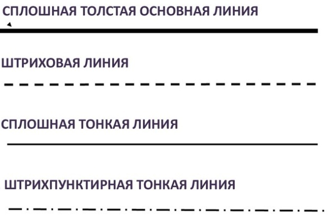

<!-- ?\vspace{14pt} -->

|                                 |                           |
| ------------------------------- | ------------------------- |
| Основная сплошная толстая линия | $s\ (0,6 - 1,5\text{мм})$ |
| Сплошная тонкая линия           | От $s/3$ до $s/2$         |
| Штрихпунктирная линия           | От $s/2$ до $2s/3$        |
| Штриховая линия                 | От $s/3$ до $s/2$         |

<!-- (0_0) -->

### 7. *Ряд размеров шрифта. Каким размером букв определяется размер шрифта?*

Устанавливаются следующие размеры шрифта:

|         |         |         |       |       |        |        |        |        |        |
| ------- | ------- | ------- | ----- | ----- | ------ | ------ | ------ | ------ | ------ |
| $1,8$мм | $2,5$мм | $3,5$мм | $5$мм | $7$мм | $10$мм | $14$мм | $20$мм | $28$мм | $40$мм |

Размер шрифта определятся высотой прописных (заглавных) букв в мм.

### 8. *Какое изображение называется видом?*

**Видом** называется изображение, на котором показана обращенная к наблюдателю видимая часть поверхности предмета.

### 9. *Как называются виды, получаемые на основных плоскостях проекций? Как располагают на чертеже основные виды?*

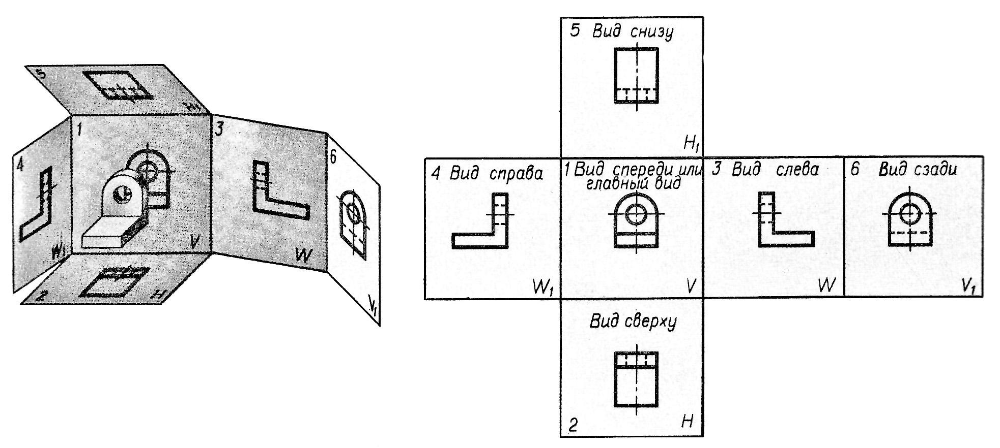

### 10. *Какое изображене предмета на чертеже принимают в качестве главного? Какие к нему требования?*

Изображение на фронтальной плоскости проекций принимается на чертеже в качестве **главного**. Главный вид должен давать наиболее полное представление о форме и размерах детали.

### 11. *Какое изображение называют дополнительным видом, местным видом?*

**Дополнительный вид** - получается проецированием предмета на плоскость, не параллельную ни одной из основных плоскостей проекций. Применяется в тех случаях, когда изображение предмета или его элемента не может быть показано на основных линиях без искажения формы и размеров.

**Местный вид** - изображение отдельного, ограниченного места поверхности предмета.
Применяется в тех случаях, когда из всего вида только часть его необходима для уточнения формы предмета.

### 12. *Какое изображение называется разрезом?*

**Разрезом** называется изображение предмета, полученное при мысленном рассечении его одной или несколькими секущими плоскостями.
При этом часть предмета, расположенная между наблюдателем и секущей плоскостью, мысленно удаляется, а на плоскости проекций изображается то, что получается в секущей плоскости и что расположено за ней.

### 13. *Как обозначают разрезы на чертежах в общем случае?*

Положение секущей плоскости указывается разомкнутой линией. Штрихи разомкнутой линии не должны пересекать контур детали. На штрихах разомкнутой линии перпендикулярно к ним ставят стрелки, указывающие направления взгляда. Около каждой стрелки наносится одна и та же прописная буква.

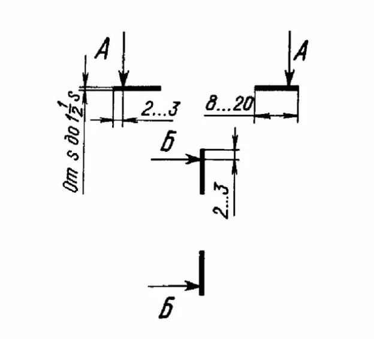

Надпись над разрезом содержит две буквы, которыми обозначена секущая плоскость, написанные через тире.

Фигура сечения предмета заштриховывается тонкими линиями под углом $45^{\circ}$ (если при этом линии штриховки параллельны линиям контура предмета или осевым линиям, то допускаются углы $30^{\circ}$ и $60^{\circ}$). Их наклон может выполняться влево или вправо, но в одну сторону на всех сечениях, относящихся к одной и той же детали.

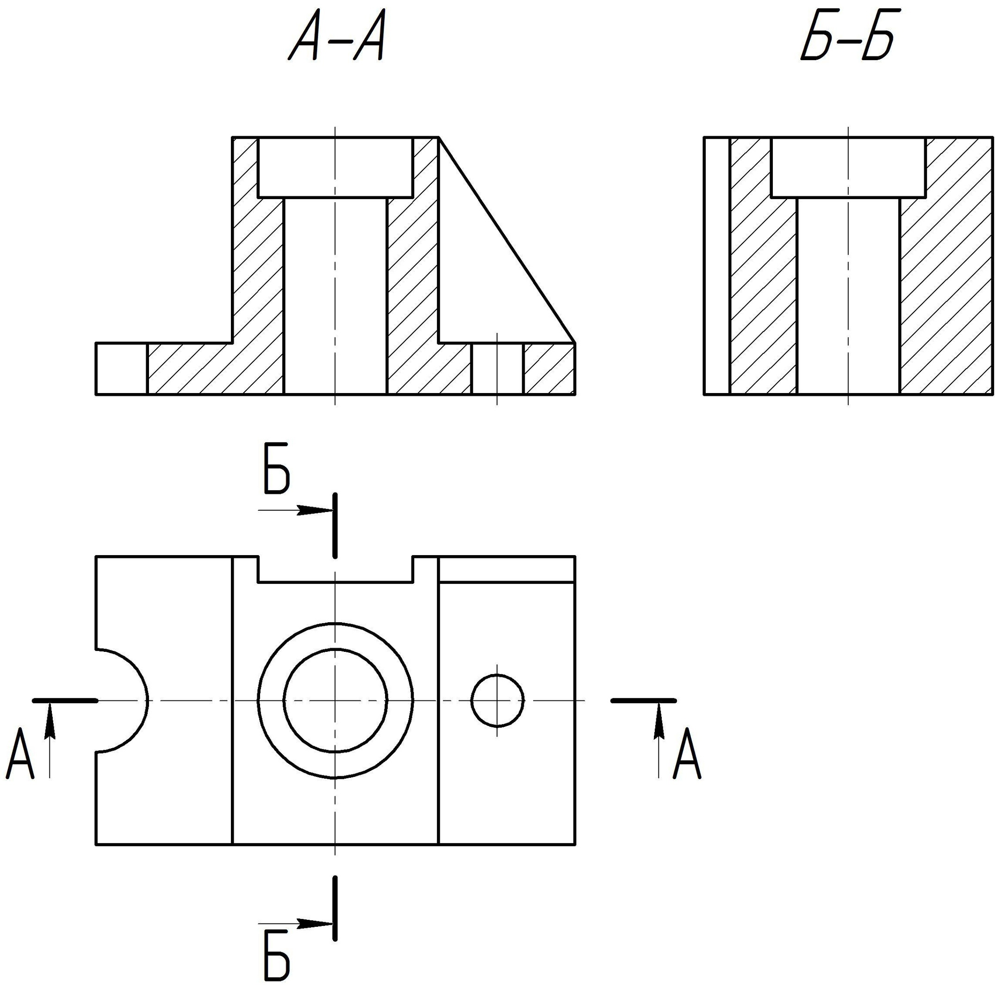

### 14. *В каких случаях не указывают положение секущей плоскости при выполнении разреза?*

В случаях, когда **секущая плоскость совпадает с плоскостью симметрии предмета**, не указывают положение секущей плоскости при выполнении разреза.

### 15. *Как называются разрезы, расположенные на месте соответствующих видов?*

**Горизонтальные разрезы** (секущая плоскость параллельна горизонтальной плоскости проекций), **фронтальные разрезы** (секущая плоскость параллельна фронтальной плоскости проекций) и **профильные разрезы** (секущая плоскость параллельна профильной плоскости проекций) могут размещаться на месте соответствующих основных видов.

### 16. *Как разделяются разрезы в зависимости от числа секущих плоскостей?*

**Простые разрезы** - разрезы, образованные одной секущей плоскостью.

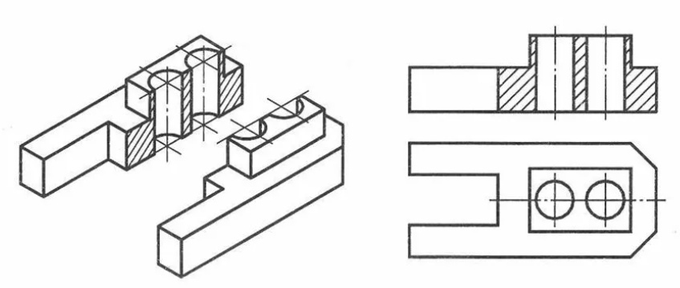

**Сложные разрезы** - разрезы, образованные двумя и более секущими плоскостями.

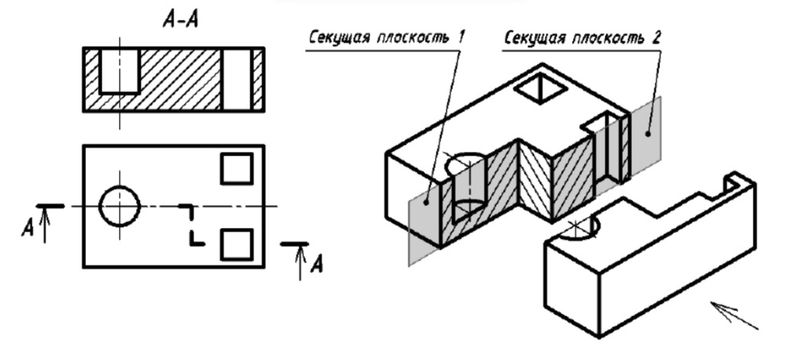

### 17. *Какие линии являются разделяющими при соединении части вида и части соответствующего разреза?*

Для соединения части вида и части разреза используются:

* Штрихпунктирные (осевые)

    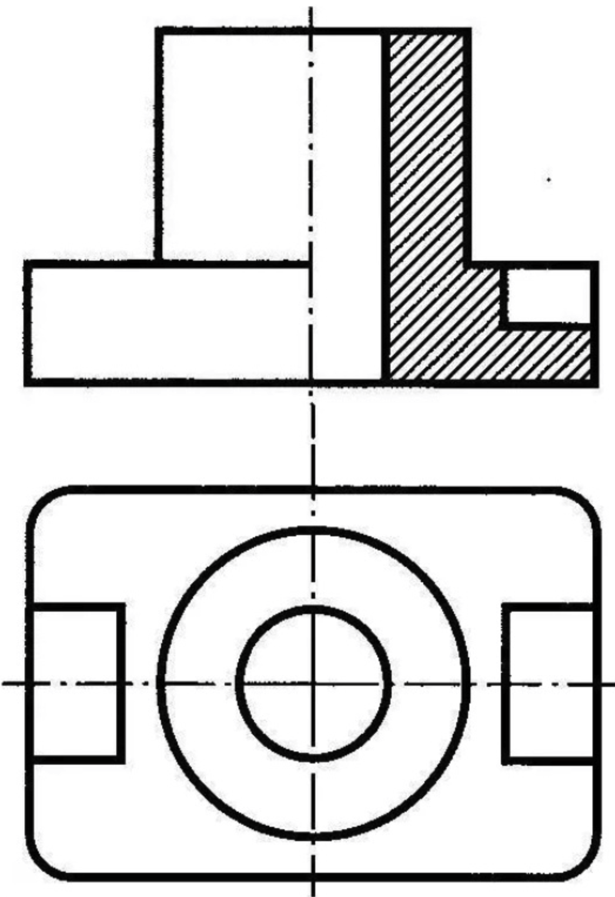

* Сплошные волнистые - если с границей части вида и разреза совпадает линия контура.

    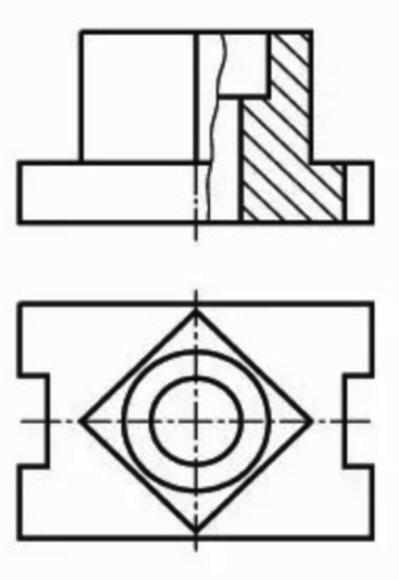

### 18. *Как показывают на разрезе тонкие стенки типа ребер жесткости, если секущая плоскость направлена вдоль их длинной стороны?*

Тонкие стенки типа ребер жесткости показывают **незаштрихованными**, если секущая плоскость проходит вдоль длинной стороны элемента.

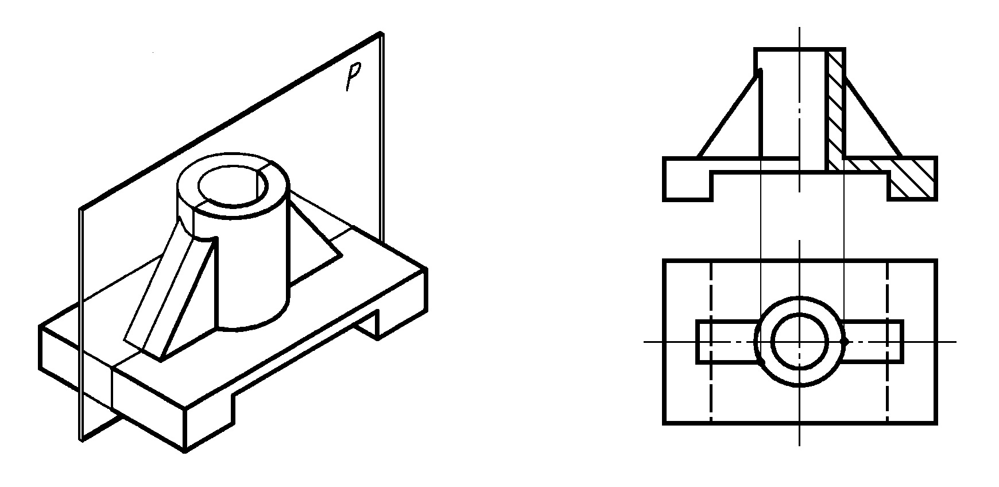

### 19. *Какое изображение называют сечением? Какое сечение называют вынесенным, наложенным?*

**Сечение** - ортогональная проекция фигуры, получающейся в одной или нескольких секущих плоскостях или поверхностях при мысленном рассечении проецируемого предмета.
На сечении показывают только то, что находится непосредственно в секущей плоскости.

**Вынесенное сечение** - сечение, располагающееся на свободном поле чертежа.

**Наложенное сечение** - сечение, располагающееся непосредственно на изображении предмета.

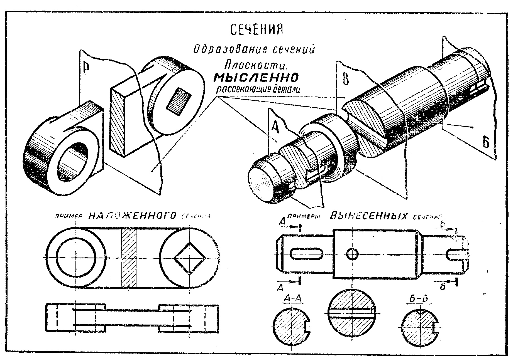

### 20. *Какие сечения не обозначают на чертеже?*

При выполнении **вынесенных** и **наложенных симметричных** сечений положение секущей плоскости не указывается. 

### 21. *В каких случаях сечение следует заменять разрезом?*

Если сечение получается состоящим из отдельных частей, то сечение должно быть заменено разрезом.

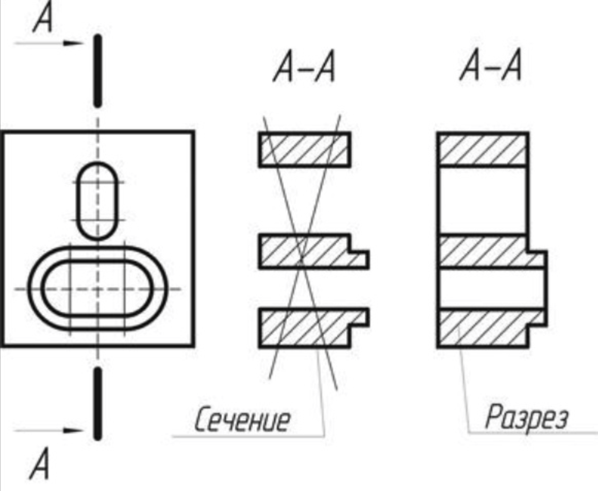

### 22. *Как графически на чертежах обозначают материалы в сечениях, на разрезах?*

Материалы в сечениях и разрезах обозначают с помощью разных типов штриховки.

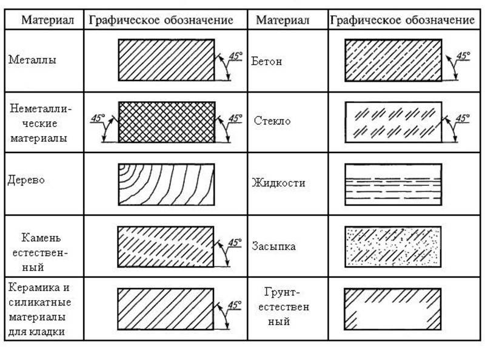

### 23. *Как выбирают направление линий штриховки и расстояние между ними для разных изображений одного и того же предмета на чертеже?*

Линии штриховки должны проводиться под углом $45^{\circ}$ (если при этом линии штриховки параллельны линиям контура предмета или осевым линиям, то допускаются углы $30^{\circ}$ и $60^{\circ}$). Их наклон может выполняться влево или вправо, но в одну сторону на всех сечениях, относящихся к одной и той же детали.

Расстояния между линиями штриховки должны быть одинаковыми для всех выполняемых в одном и том же масштабе сечений данной детали. Это расстояние выбирается от $1$ до $10 \text{мм}$, в зависимости от площади штриховки: большее расстояние соответствует большей площади фигуры сечения.   

### 24. *Чему равно минимальное растояние между размерной линией и линией контура изображения, между параллельными размерными линиями?*

Минимальное расстояние между параллельными размерными линиями составляет $7$мм, а между размерной линией и линией контура - $10$мм.

### 25. *В каких единицах измерения указывают размеры на чертежах?*

Линейные размеры принято наносить в миллиметрах без указания единицы измерения. Если на чертеже нужно указать размеры не в мм, а в других единицах измерения, то соответствующие размерные числа записывают с обозначением единицы измерения.

